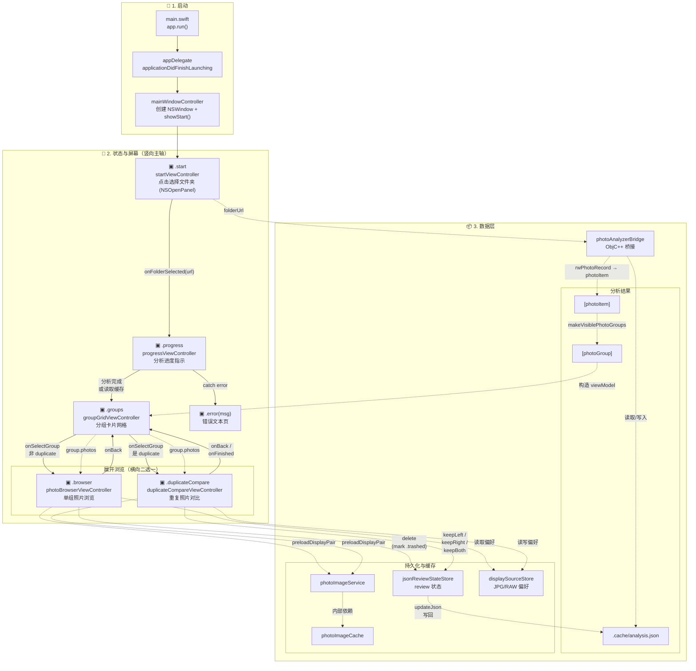
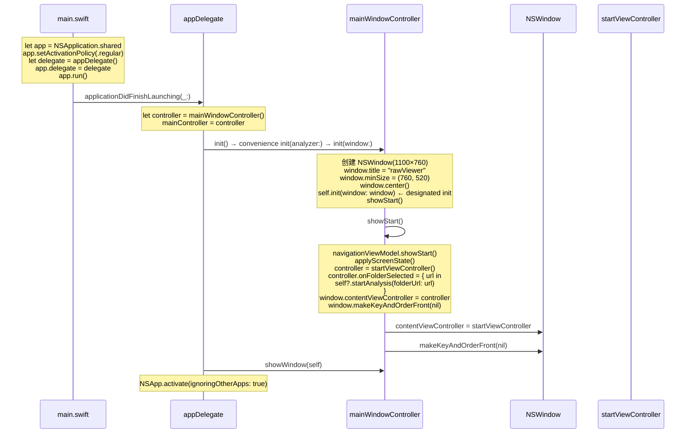
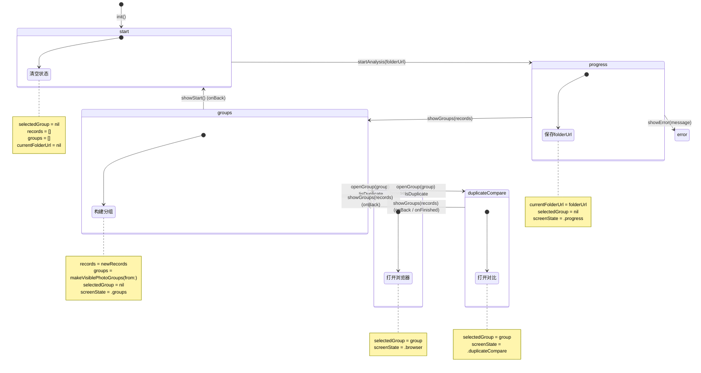
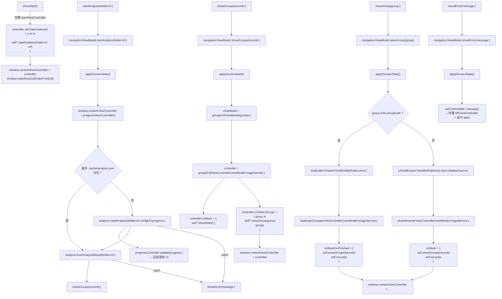
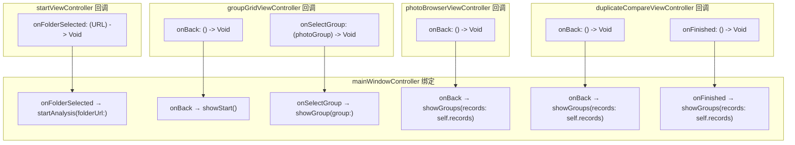
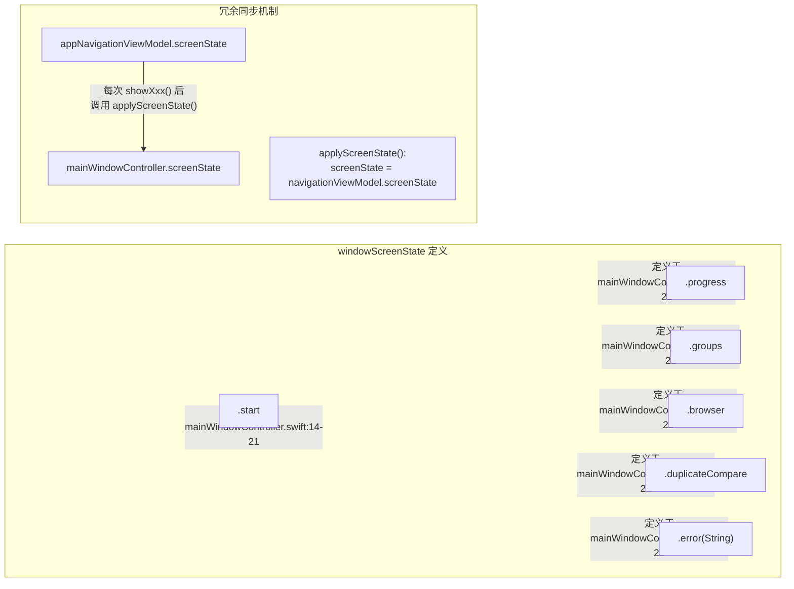

# rawViewer App 架构 — 逻辑与数据流图

> 所有节点均对应实际代码，非推测。采用总-分结构。

---

## 一、总览：App 架构全景图

> 设计原则：**从上往下，三层递进**：启动链 → 状态/屏幕主轴 → 数据层。
> 主流程用**实线**，数据流用**虚线**，返回线明确标注 `onBack`。

---

## 二、分图

### 2.1 启动流程

**对应代码：**

| 步骤 | 文件 | 关键代码 |
|------|------|----------|
| 入口 | `main.swift` | `let app = NSApplication.shared` / `app.run()` |
| 代理回调 | `appDelegate.swift:13` | `func applicationDidFinishLaunching(_:)` |
| 窗口创建 | `mainWindowController.swift:42-54` | `convenience init(analyzer:)` 创建 NSWindow，调用 designated init |
| 首屏展示 | `mainWindowController.swift:68-78` | `showStart()` 设置 startViewController |
| 启动完成 | `appDelegate.swift:24-25` | `controller.showWindow(self)` / `NSApp.activate(...)` |

---

### 2.2 导航状态 (windowScreenState)

> **注意：** `appNavigationViewModel` 与 `mainWindowController` 各自持有相同的 `screenState`、`records`、`selectedGroup`、`currentFolderUrl`，存在状态冗余。实际导航由 `mainWindowController` 驱动——它先调用 `navigationViewModel.xxx()` 更新状态，再通过 `applyScreenState()` 把 `screenState` 同步回自身。`navigationViewModel` 中存储的 `records`/`groups`/`selectedGroup`/`currentFolderUrl` 在 `mainWindowController` 中基本未被读取。

> **注意：** `appNavigationViewModel` 中的 `backToStart()` 和 `backToGroups()` 方法从未被 `mainWindowController` 调用。实际的回退导航由 `mainWindowController` 直接调用自身的 `showStart()` / `showGroups(records:)` 方法驱动。

**对应代码：**

| 状态转换 | 实际调用的 ViewModel 方法 | 文件 |
|----------|------|------|
| `→ .start` | `showStart()` | `appNavigationViewModel.swift:23-29` |
| `start → .progress` | `startAnalysis(folderUrl:)` | `appNavigationViewModel.swift:31-35` |
| `.progress → .groups` | `showGroups(records:)` | `appNavigationViewModel.swift:37-42` |
| `.groups → .browser` | `openGroup(_:)` 非 duplicate | `appNavigationViewModel.swift:44-47` |
| `.groups → .duplicateCompare` | `openGroup(_:)` 是 duplicate | `appNavigationViewModel.swift:44-47` |
| `.groups → .start` | `showStart()`（由 onBack 回调触发） | `appNavigationViewModel.swift:23-29` |
| `.browser → .groups` | `showGroups(records:)`（由 onBack 回调触发） | `appNavigationViewModel.swift:37-42` |
| `.duplicateCompare → .groups` | `showGroups(records:)`（由 onBack/onFinished 回调触发） | `appNavigationViewModel.swift:37-42` |
| `* → .error` | `showError(message:)` | `appNavigationViewModel.swift:64-66` |

---

### 2.3 mainWindowController 屏幕切换逻辑

**对应代码：**

| 方法 | 文件:行 | 核心逻辑 |
|------|---------|----------|
| `showStart()` | `mainWindowController.swift:68-78` | 创建 startViewController，绑定 onFolderSelected |
| `startAnalysis(folderUrl:)` | `mainWindowController.swift:80-100` | 检查缓存 → 异步分析 → showGroups / showError |
| `showGroups(records:)` | `mainWindowController.swift:102-115` | 构建 groupGridViewModel → groupGridViewController |
| `showGroup(group:)` | `mainWindowController.swift:117-145` | 按 isDuplicate 分流到 browser 或 duplicateCompare |
| `showError(message:)` | `mainWindowController.swift:147-151` | 简单文本页 |

---

### 2.4 数据流：从文件夹到 UI

```mermaid
flowchart LR
    subgraph 输入["📂 输入"]
        FOLDER["folderUrl<br/>(用户点击选择)"]
    end

    subgraph 分析["⚙️ 分析层"]
        CACHE_CHECK{"FileExists<br/>.cache/analysis.json"}
        LOAD["analyzer.loadAnalysisResult(folderUrl:)"]
        ANALYZE["analyzer.startAnalysis(folderUrl:configUrl:)<br/>→ async Task"]
        PROGRESS_CB["progress(progress)<br/>→ progressViewController.update()"]
    end

    subgraph 转换["🔄 模型转换"]
        OBJC["rwPhotoRecord (ObjC++)"]
        ITEM["photoItem (Swift)"]
        FILTER["filter: reviewStatus != .passed/.trashed"]
        GROUP["makeVisiblePhotoGroups(from:)"]
    end

    subgraph 分组["📊 分组结果"]
        G_OVER["photoGroup(.overexposed)"]
        G_UNDER["photoGroup(.underexposed)"]
        G_BLUR["photoGroup(.blurry)"]
        G_NORM["photoGroup(.normal)"]
        G_DUP["photoGroup(.duplicate(id))"]
    end

    subgraph 展示["🖥️ UI 展示"]
        GRID["groupGridViewController<br/>→ groupCardView × N"]
        BROWSER["photoBrowserViewController<br/>→ metalPhotoView + thumbnailView"]
        DUP_VC["duplicateCompareViewController<br/>→ leftPhotoView + rightPhotoView"]
    end

    subgraph 持久化["💾 持久化"]
        JSON_FILE[".cache/analysis.json"]
        REVIEW_STORE["jsonReviewStateStore<br/>mark(photoId:status:)<br/>setTemplate(reviewGroupId:templatePhotoId:)"]
    end

    FOLDER -->|"startAnalysis"| CACHE_CHECK
    CACHE_CHECK -->|"存在"| LOAD
    CACHE_CHECK -->|"不存在"| ANALYZE
    ANALYZE -->|"进度回调"| PROGRESS_CB
    ANALYZE -->|"完成"| LOAD
    ANALYZE -->|"写入"| JSON_FILE
    LOAD -->|"读取"| JSON_FILE
    LOAD --> OBJC
    OBJC -->|"photoAnalyzerBridge.swift: map"| ITEM
    ITEM --> FILTER
    FILTER --> GROUP
    GROUP --> G_OVER & G_UNDER & G_BLUR & G_NORM & G_DUP
    G_OVER & G_UNDER & G_BLUR & G_NORM & G_DUP -->|"groupGridViewModel"| GRID
    GRID -->|"onSelectGroup<br/>!isDuplicate"| BROWSER
    GRID -->|"onSelectGroup<br/>isDuplicate"| DUP_VC

    BROWSER -->|"delete (mark .trashed)"| REVIEW_STORE
    DUP_VC -->|"keepLeft / keepRight / keepBoth"| REVIEW_STORE
    REVIEW_STORE -->|"updateJson → 写回"| JSON_FILE
```

**对应代码：**

| 环节 | 文件 | 关键代码 |
|------|------|----------|
| 缓存检查 | `mainWindowController.swift:88` | `FileManager.default.fileExists(atPath: .cache/analysis.json)` |
| 异步分析 | `photoAnalyzerBridge.swift:16-43` | `withCheckedThrowingContinuation` 包装 ObjC++ callback |
| 模型转换 | `photoAnalyzerBridge.swift:45-62` | `rwPhotoRecord → photoItem` map |
| 分组构建 | `photoModels.swift:111-126` | `makeVisiblePhotoGroups(from:)` |
| 分组过滤 | `photoModels.swift:112` | `filter { reviewStatus != .passed && != .trashed }` |
| 状态持久化 | `jsonReviewStateStore.swift:25-44` | `mark(photoId:status:)` / `setTemplate(...)` |
| JSON 读写 | `jsonReviewStateStore.swift:48-56` | `updateJson(_:)` 读取 → mutate → 原子写回 |

---

### 2.5 回调链与闭包绑定关系

**对应代码：**

| 绑定 | 文件:行 |
|------|---------|
| `onFolderSelected → startAnalysis` | `mainWindowController.swift:72-74` |
| `groups.onBack → showStart` | `mainWindowController.swift:108-110` |
| `groups.onSelectGroup → showGroup` | `mainWindowController.swift:111-113` |
| `browser.onBack → showGroups` | `mainWindowController.swift:139-142` |
| `duplicate.onBack → showGroups` | `mainWindowController.swift:125-128` |
| `duplicate.onFinished → showGroups` | `mainWindowController.swift:129-132` |

---

### 2.6 windowScreenState 状态枚举与冗余同步机制

> **问题：** `mainWindowController` 和 `appNavigationViewModel` 各自持有 `screenState`，形成"先写 ViewModel → 再同步回 Controller"的冗余链路。`navigationViewModel` 中的 `records`/`groups`/`selectedGroup`/`currentFolderUrl` 与 `mainWindowController` 的同名属性重复存储，且后者几乎不读取前者的这些值。

**对应代码：**

| 项 | 文件:行 |
|----|---------|
| 枚举定义 | `mainWindowController.swift:14-21` |
| ViewModel 中的 screenState | `appNavigationViewModel.swift:15` |
| Controller 中的 screenState | `mainWindowController.swift:24` |
| 同步方法 | `mainWindowController.swift:153-155` — `applyScreenState()` |
| 冗余属性对比 | `mainWindowController.swift:24-27` vs `appNavigationViewModel.swift:15-19` |
