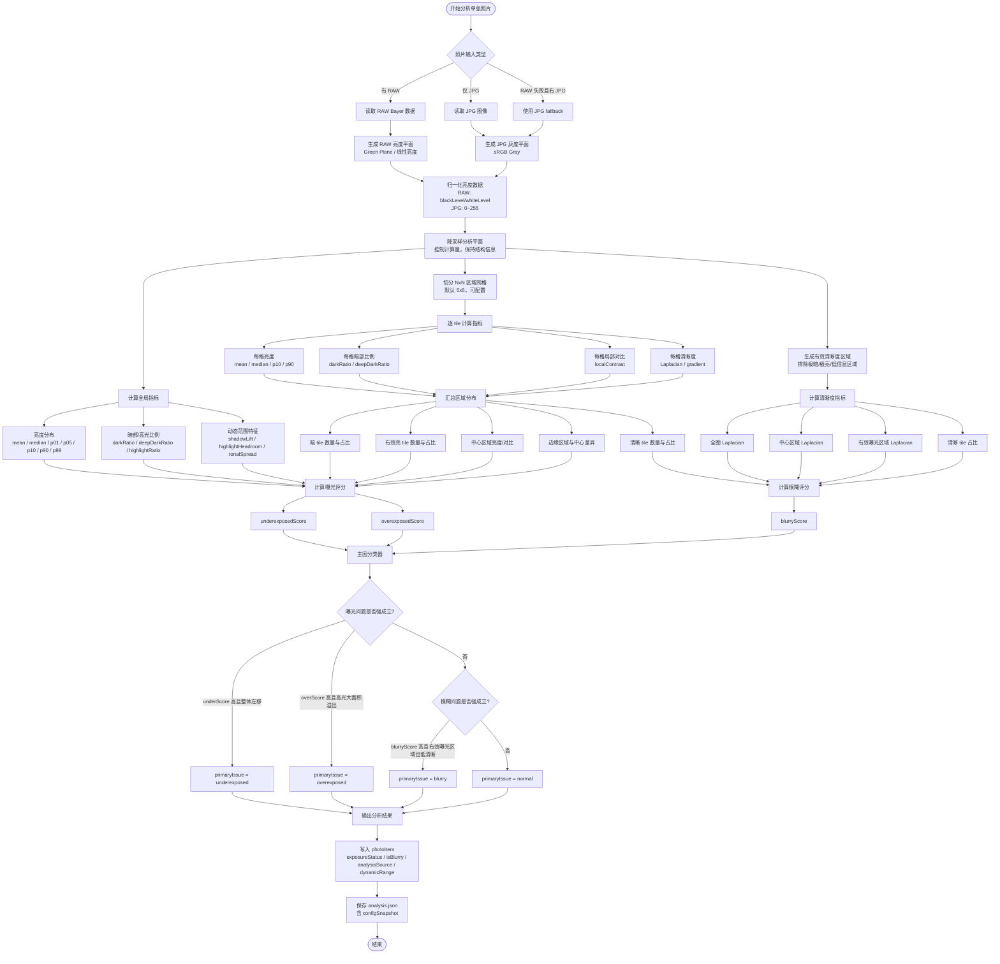
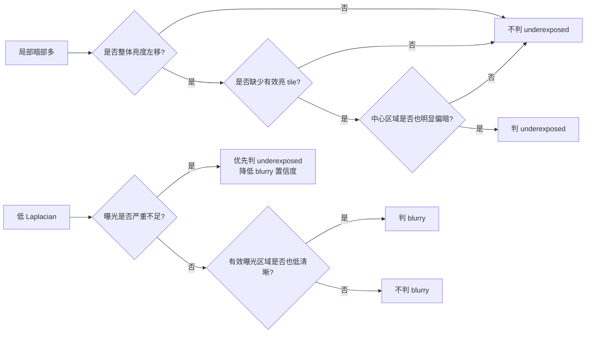
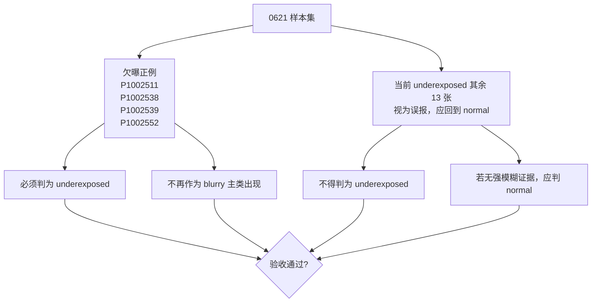

# 综合曝光 / 模糊检测算法处理逻辑图

日期：2026-06-22  
状态：设计草稿  
目标：用“全局统计 + 网格区域统计 + 主因分类”替代当前单阈值曝光/模糊判断，减少 underexposed / blurry 误报。

## Mermaid 流程图

## 关键判断原则

## 面向 0621 的验收逻辑

## 设计备注

- 网格默认建议从 `5x5` 开始：比 `3x3` 更能区分局部阴影，又不会像 `8x8` 那样过度敏感。
- 曝光判定不再只看暗像素比例，而是要求多个条件共同成立：整体亮度偏低、有效亮区缺失、暗 tile 覆盖广、中心区域也偏暗。
- 模糊判定不再只看全图 Laplacian，而是在“有效曝光区域”里判断清晰度，避免欠曝照片因为低对比被误判 blurry。
- 最终输出仍兼容现有 UI 字段：`exposureStatus` 和 `isBlurry`，但内部增加评分与主因分类逻辑。
