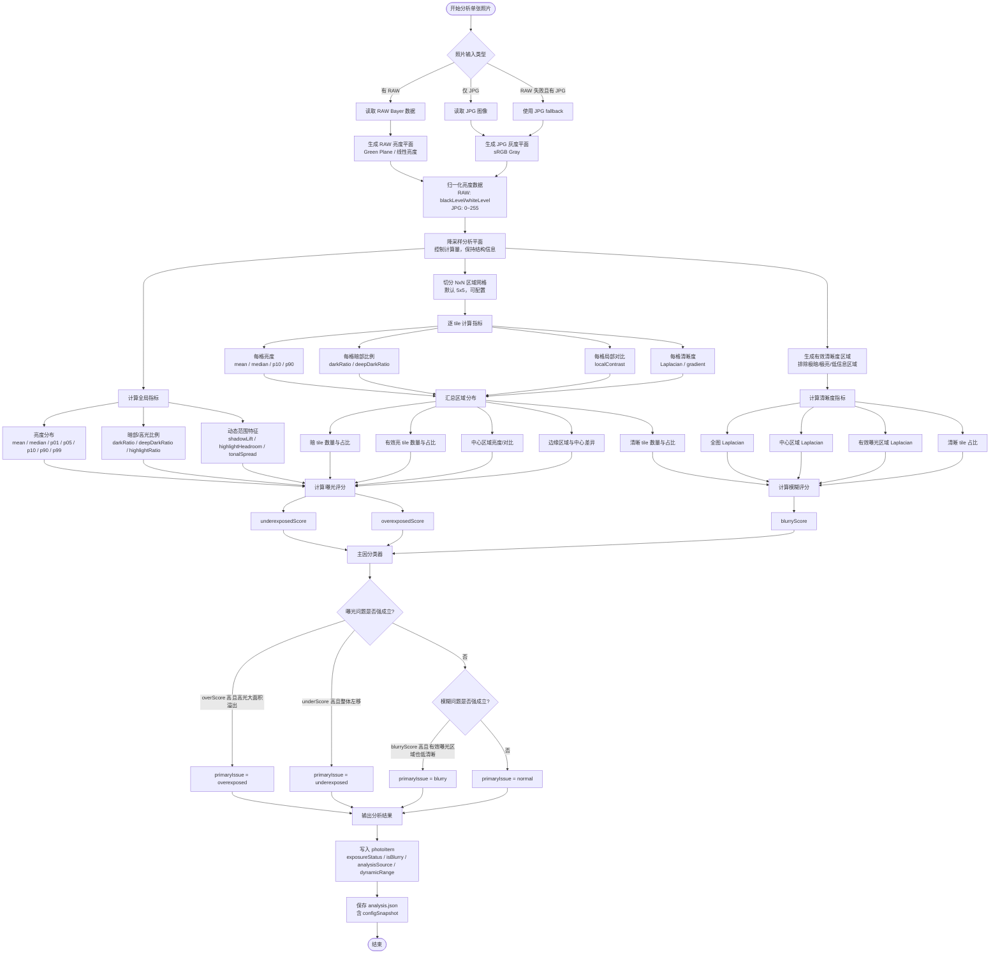
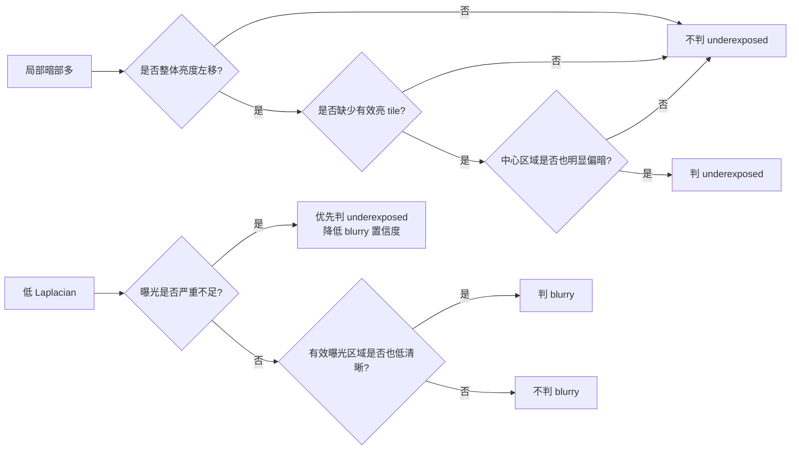
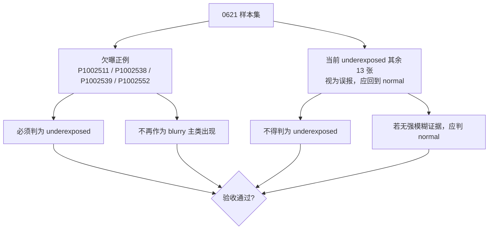

# Recipe：综合曝光 / 模糊检测算法（全局 + 网格区域 + 主因分类）

- 日期：2026-06-22
- 状态：已确认设计，待实现
- 关联：替代当前 `rawBayerAnalyzer` / `jpgAnalyzer` 的单阈值曝光/模糊判断
- 验收集：`~/Downloads/0621`（145 张，RAW `.RW2` + JPG）

## 1. 背景与问题

当前算法对曝光和模糊都采用单阈值判断：

- 曝光：暗像素比例超过 `underexpose_ratio_limit` 即判欠曝；
- 模糊：全图 Laplacian 方差低于阈值即判虚焦；
- 两者独立计算，没有主因优先级，同一张照片可同时落入多个问题桶。

实测 `0621` 后发现两类明显问题：

1. **欠曝误报多**：当前被判 `underexposed` 的 17 张里，13 张其实只是局部暗部重，整体并不欠曝。
2. **欠曝被误归 blurry**：真正欠曝的 4 张（`P1002511 / P1002538 / P1002539 / P1002552`）当前被归到 blurry，因为低光导致 Laplacian 偏低。

根因：单阈值无法区分“局部暗部”与“整体欠曝”，也无法在低光下抑制模糊误判。

## 2. 目标与验收标准

### 2.1 目标

用“全局统计 + 网格区域统计 + 主因分类”替代单阈值：

- 区分“局部暗部正常照片”与“整体欠曝照片”；
- 低光/欠曝照片不被误归为 blurry；
- 最终分组互斥，曝光优先级第一，模糊优先级第二。

### 2.2 `0621` 验收标准

| 编号 | 要求 |
|---|---|
| AC1 | `P1002511 / P1002538 / P1002539 / P1002552` 必须判为 `underexposed` |
| AC2 | 上述 4 张不得作为 blurry 主类出现（`isBlurry = false`） |
| AC3 | 当前 `underexposed` 其余 13 张必须回到 `normal`（`P1002441 / P1002461 / P1002485 / P1002489 / P1002490 / P1002491 / P1002496 / P1002549 / P1002551 / P1002555 / P1002561 / P1002580 / P1002581`；`exposureStatus = "normal"`，`isBlurry = false`） |
| AC4 | 没有强模糊证据的误报照片不得被判 `blurry` |
| AC5 | `configSnapshot` 变化后自动触发重新分析 |

### 2.3 欠曝正例基准（用户提供）

- `P1002511`
- `P1002538`
- `P1002539`
- `P1002552`

当前 `underexposed` 里其余 13 张视为正常样本/误报样本：`P1002441 / P1002461 / P1002485 / P1002489 / P1002490 / P1002491 / P1002496 / P1002549 / P1002551 / P1002555 / P1002561 / P1002580 / P1002581`。

## 3. 总体架构

三层结构，GPU 只做特征提取，CPU 做评分与分类：

```plain
RAW/JPG 输入
  ↓
基础特征提取层（GPU）
  - 全局亮度直方图
  - NxN 网格亮度统计
  - 网格局部对比
  - 网格/中心/有效曝光区域清晰度
  ↓
评分层（CPU）
  - underexposedScore
  - overexposedScore
  - blurryScore
  ↓
主因分类层（CPU）
  - primaryIssue = underexposed / overexposed / blurry / normal
  ↓
兼容现有输出
  - exposureStatus
  - isBlurry
  - dynamicRange
```

保留现有外部接口，不扩展 UI / 存储字段。内部允许有更复杂的 feature / score / primaryIssue，但第一版不写进 `photoItem`，调试期通过日志输出。

## 4. 类别映射规则（互斥）

内部先判断唯一主类别 `primaryIssue`，再映射到现有 UI 字段：

| primaryIssue | exposureStatus | isBlurry | UI 分组 |
|---|---|---:|---|
| `normal` | `"normal"` | `false` | Normal |
| `underexposed` | `"underexposed"` | `false` | Underexposed |
| `overexposed` | `"overexposed"` | `false` | Overexposed |
| `blurry` | `"normal"` | `true` | Blurry |
| `failed` | `"failed"` | `false` | 按现有失败逻辑处理 |

核心约束：

- 一张照片最终只进一个分析分组；
- 同一张照片不会因分析字段同时进入 Underexposed 和 Blurry；
- 当 `primaryIssue = underexposed` 时，即使存在低清晰度证据，`isBlurry` 也写成 `false`。

内部可保留 `secondarySignals`（如 `lowSharpness`、`localShadowHeavy`、`highlightClipping`）用于调试，但不映射到 UI。

主因分类顺序（已确认）：

```plain
1. overexposed 强成立
2. underexposed 强成立
3. blurry 强成立
4. normal
```

## 5. 特征提取

### 5.1 分析平面

| 来源 | 分析平面 |
|---|---|
| RAW | Bayer Green Plane，按 black/white level 归一化 |
| JPG | 8-bit grayscale，按 0~255 归一化 |

RAW 仍优先，RAW 失败才走 JPG fallback。

### 5.2 全局特征

```plain
p01 / p05 / p10 / p50(median) / p90 / p95 / p99
mean
darkRatio
deepDarkRatio
highlightRatio
tonalSpread
```

### 5.3 网格切分

- 默认 `5x5 = 25` 个 tile；
- 中心区域取 `3x3` 核心 tile 作为主体权重；
- 网格大小可配置。

选型理由：

- `3x3` 太粗，容易把局部暗部平均掉；
- `8x8` 太敏感，易被小块阴影/噪声影响；
- `5x5` 能区分中心、边缘、局部暗块，计算量可控。

### 5.4 每个 tile 的特征

```plain
tileMean
tileMedian
tileP10
tileP90
tileDarkRatio
tileDeepDarkRatio
tileHighlightRatio
tileLocalContrast = tileP90 - tileP10
tileLaplacianVariance
```

### 5.5 网格汇总特征

```plain
darkTileRatio
deepDarkTileRatio
brightTileRatio
usableTileRatio
centerDarkScore
centerBrightness
centerContrast
edgeDarkRatio
sharpTileRatio
lowContrastTileRatio
```

| 特征 | 作用 |
|---|---|
| `darkTileRatio` | 暗区域覆盖面是否大 |
| `brightTileRatio` | 是否仍有有效亮区 |
| `centerDarkScore` | 主体区域是否也偏暗 |
| `usableTileRatio` | 可用于清晰度判断的区域比例 |
| `sharpTileRatio` | 清晰 tile 占比 |
| `centerContrast` | 中心主体是否有可见对比 |

### 5.6 核心原则

新的欠曝判断不再是“暗像素比例 > 阈值”，而是：

```plain
整体亮度低
+ 暗 tile 覆盖面大
+ 有效亮 tile 少
+ 中心区域也明显偏暗
+ 不是局部阴影造成
```

新的模糊判断不再是“全图 Laplacian 低”，而是：

```plain
曝光没有强问题
+ 有效曝光区域清晰度低
+ 中心区域清晰度低
+ 清晰 tile 占比低
```

## 6. 评分与阈值

每张图算三个 `0.0~1.0` 的分数，每个分数 = 若干归一化子信号加权求和，阈值放 config。

子信号归一化参考点是值空间相关的：RAW 走线性空间（mid-gray 约 0.18 of range），JPG 走 gamma 空间（mid-gray 约 0.5 of range）。评分器共用，但每个子信号的归一化参数按来源空间取值，在实现+校准阶段对 `0621` 确定具体数值。

### 6.1 underexposedScore

核心思想：不是“有暗部”，而是“整体偏暗 + 缺有效亮区 + 主体也暗”。

| 子信号 | 含义 | 权重 |
|---|---|---:|
| `globalDarkness` | median/p50 相对中灰偏低 | 0.30 |
| `darkTileCoverage` | 暗 tile 占比 | 0.25 |
| `lackOfBrightTiles` | 1 − brightTileRatio | 0.25 |
| `centerDarkness` | 中心 3x3 亮度偏低 | 0.15 |
| `deepDarkRatio` | 死黑像素占比 | 0.05 |

触发：`underexposedScore >= 0.55` → 强成立。

对 `0621` 的预期：

- 当前误报 13 张多数 `mean` 54~93、`p90` 107~255，有效亮区不缺 → `lackOfBrightTiles` 低 → 分数拉不上去；
- 真欠曝 4 张 `mean` 14~49、`p90` 多在 31~105，整体左移且缺亮区 → 分数高。

### 6.2 overexposedScore

核心思想：高光大面积溢出，且缺少暗部锚点。

| 子信号 | 含义 | 权重 |
|---|---|---:|
| `highlightClipRatio` | 接近/超过白场的像素占比 | 0.40 |
| `brightTileCoverage` | 高光 tile 占比 | 0.30 |
| `lackOfShadowAnchor` | 1 − darkTileRatio | 0.20 |
| `highlightHeadroomLow` | p99 贴近白场 | 0.10 |

触发：`overexposedScore >= 0.55` → 强成立。

### 6.3 blurryScore

核心思想：只在“有效曝光区域”判断清晰度，避免低光照片因低对比被误判。

| 子信号 | 含义 | 权重 |
|---|---|---:|
| `usableAreaLaplacian` | 仅 usable tile 的 Laplacian 偏低 | 0.40 |
| `centerLaplacian` | 中心区域 Laplacian 偏低 | 0.30 |
| `sharpTileRatio` | 清晰 tile 占比偏低 | 0.20 |
| `lowContrastTileRatio` | 低对比 tile 占比偏高 | 0.10 |

`usable tile` 定义：曝光足够且对比足够的 tile（排除死黑、过曝、纯平坦区域）。

触发：`blurryScore >= 0.55` → 强成立。

对 `0621` 的预期：

- 真欠曝 4 张 usable tile 很少 → `blurryScore` 本身就低；
- 再加曝光优先级更高，直接归到 underexposed；
- 真正模糊的照片在有效曝光区域仍低 Laplacian → 仍能被抓。

### 6.4 主因分类

```plain
if overexposedScore >= overexposed_threshold:
    primaryIssue = overexposed
else if underexposedScore >= underexposed_threshold:
    primaryIssue = underexposed
else if blurryScore >= blurry_threshold:
    primaryIssue = blurry
else:
    primaryIssue = normal
```

曝光优先，模糊其次，互斥。

## 7. GPU / CPU 实现与落点

### 7.1 实现策略

- **GPU**：大规模像素遍历，产出特征数据（直方图、网格统计、Laplacian）；
- **CPU**：读 GPU 产出的特征，做评分与主因分类。

评分逻辑是少量数据的加权与规则判断，CPU 跑足够快且更易调试。

### 7.2 GPU kernel 复用

| 现有 kernel | 是否保留 | 改动 |
|---|---|---|
| `bayerHistogramKernel` | 保留 | 扩展：同时按网格累计每 tile 的亮度/暗部/高光 |
| `bayerToGreenPlaneKernel` | 保留 | 不动 |
| `greenLaplacianKernel` | 保留 | 不动 |
| `reduceLaplacianKernel` | 保留 | 扩展：支持按 tile 分组规约 Laplacian |
| `rgbToGrayKernel` | 保留 | 不动 |
| `jpgHistogramKernel` | 保留 | 扩展：同 RAW，按网格累计 |
| `jpgLaplacianKernel` | 保留 | 不动 |

不新增独立大 kernel，尽量在现有 kernel 里附带产出网格统计，避免 command buffer 过多。

### 7.3 网格统计实现

per-tile 原子计数 buffer：

```plain
gridRows * gridCols 个 tile
每个 tile 维护：
  - 亮度直方图（降采样 bin，如 32 或 64 bin）
  - darkPixelCount
  - highlightPixelCount
  - laplacianSum / laplacianSumSq
  - pixelCount
```

GPU 遍历像素时按坐标算出所属 tile，原子累加。CPU 后处理时对每个 tile 算 `mean / p10 / p90 / darkRatio / laplacianVariance`，汇总成全局 + 网格特征，跑评分与分类。

### 7.4 降采样策略

```plain
对分析平面先降采样到约 1.5~2MP 再做网格统计
Laplacian 仍在该降采样平面上算
```

`5x5 = 25` 个 tile，每 tile 64 bin 直方图 = 1600 bin，内存可控，计算量与现在基本持平。

### 7.5 RAW / JPG 统一评分

把“从特征到分类”抽成共享类型：

```plain
analysisFeatures
  - globalExposureFeatures
  - tileExposureFeatures
  - blurFeatures

analysisScores
  - underexposedScore
  - overexposedScore
  - blurryScore

primaryIssue
```

RAW / JPG 两个 analyzer 都产出 `analysisFeatures`，调用同一个评分器：

```plain
scoringEngine.score(features, config) -> analysisScores
classifier.classify(scores, config) -> primaryIssue
```

分类逻辑完全一致；特征提取的数值空间不同（线性 vs gamma），因此亮度/对比/Laplacian 相关阈值按 RAW/JPG 分成两套配置，避免一套阈值同时服务两个值空间导致校准互相污染。

### 7.6 代码落点

| 文件 | 改动 |
|---|---|
| `rawAnalysisShaders.metal` | 扩展 bayer/jpg histogram kernel 产出网格统计；扩展 reduce 支持按 tile 规约 |
| `rawBayerAnalyzer.swift` | 从“直接算 status”改为“提取 features → 评分 → 分类 → 映射” |
| `jpgAnalyzer.swift` | 同上，复用共享评分器 |
| 新增 `analysisScoring.swift` | `analysisFeatures` / `analysisScores` / `primaryIssue` 类型 + 评分器 + 分类器，RAW/JPG 共用 |
| `analysisConfig.swift` | 新增 `gridAnalysisConfig` / `scoringConfig` |
| `config.yaml` | 新增 `grid_analysis` / `scoring` 段 |
| `configLoader.swift` | 解析新配置段 |
| `metalAnalysisContext.swift` | 可能新增少量 pipeline（若 kernel 签名变化） |
| `photoModels.swift` | 暂不动存储字段，仍映射到 `exposureStatus` + `isBlurry` |

## 8. 配置结构

旧的 `exposure_detection` / `blur_detection` 字段保留；新增 `grid_analysis` / `scoring`。缓存兼容通过 `configSnapshot.analysisAlgorithmVersion = "grid-v1"` 明确控制：缺失该字段的旧单阈值缓存必须视为 stale 并触发重新分析。

```yaml
exposure_detection:
  overexpose_pixel_threshold: 0.975
  underexpose_pixel_threshold: 0.01
  overexpose_ratio_limit: 0.2
  underexpose_ratio_limit: 0.3

grid_analysis:
  rows: 5
  columns: 5
  center_rows: 3
  center_columns: 3

scoring:
  underexposed_threshold: 0.55
  overexposed_threshold: 0.55
  blurry_threshold: 0.55
  deep_dark_pixel_threshold: 0.002
  # RAW/JPG 值空间不同，涉及亮度/对比/Laplacian 的阈值使用 raw/jpg 两套字段
  dark_tile_mean_threshold_raw: 0.05
  dark_tile_mean_threshold_jpg: 0.08
  bright_tile_p90_threshold_raw: 0.4
  bright_tile_p90_threshold_jpg: 0.55
  usable_tile_min_brightness_raw: 0.05
  usable_tile_min_brightness_jpg: 0.08
  usable_tile_min_contrast_raw: 0.03
  usable_tile_min_contrast_jpg: 0.08
  sharp_tile_laplacian_threshold_raw: 0.0005
  sharp_tile_laplacian_threshold_jpg: 0.0005
  laplacian_low_threshold_raw: 0.0005
  laplacian_low_threshold_jpg: 0.0005

blur_detection:
  laplacian_threshold_raw: 5000.0
  laplacian_threshold_jpg: 10.0

analysis:
  metal_concurrency: 6
```

`configSnapshot` 变化后 `analysisStore` 现有逻辑自动拒绝旧缓存 → 触发重新分析，无需额外改 `analysisStore`。`analysis.json` 的 `schemaVersion` 保持 `2.0`，因为 `photoItem` 字段不变。

## 9. 校准方式

阈值不拍脑袋，以 `0621` 为验收集：

- 真欠曝 4 张必须 `underexposedScore >= 0.55`；
- 当前误报 13 张必须 `underexposedScore < 0.55`；
- 实现阶段用离线脚本跑全量特征，确认分离度后再写进 config；
- 离线脚本只在实现期用，不进 app bundle。

## 10. 测试策略

由于项目规范“严谨使用任何测试框架来测试代码”，采用以下验证方式：

1. **离线特征校准脚本**：对 `0621` 全量图跑特征提取，输出每张图的 features + scores + primaryIssue，确认 AC1~AC3 通过。
2. **app 内运行验证**：在 Xcode 编译运行，对 `0621` 重新分析，确认分组结果符合 AC1~AC4。
3. **配置变更回归**：修改 config 后重新加载，确认旧缓存被拒绝、触发重新分析（AC5）。
4. **回归保护**：确认原本正常的照片不会因新算法被错误降级。

## 11. 算法处理逻辑图（Mermaid）

### 11.1 完整流程



### 11.2 关键判断原则



### 11.3 `0621` 验收逻辑



## 12. 范围边界（YAGNI）

本设计明确不做：

- 不引入机器学习/训练模型；
- 不扩展 UI 字段或 JSON schema（`photoItem` 不变）；
- 不把 score/feature 持久化进 `analysis.json`（仅日志）；
- 不改 Duplicate / reviewStatus 分组逻辑；
- 不做多机机型适配的阈值库（单组阈值 + config 校准）。
