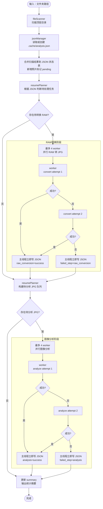
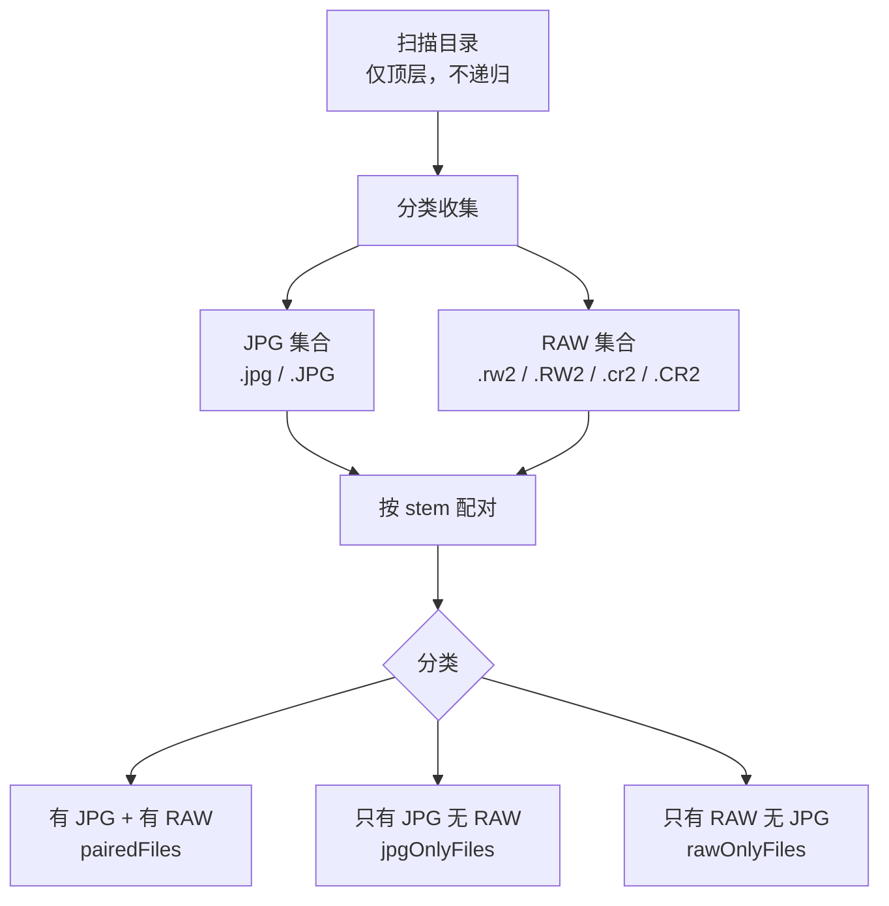
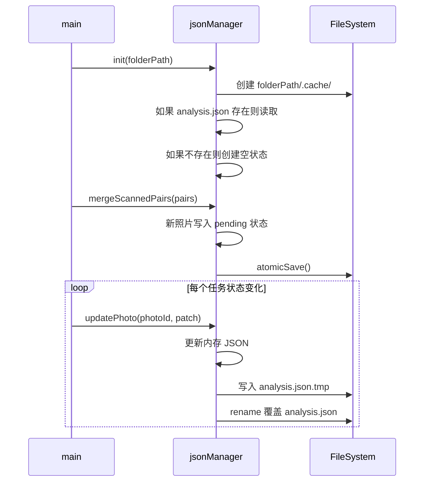
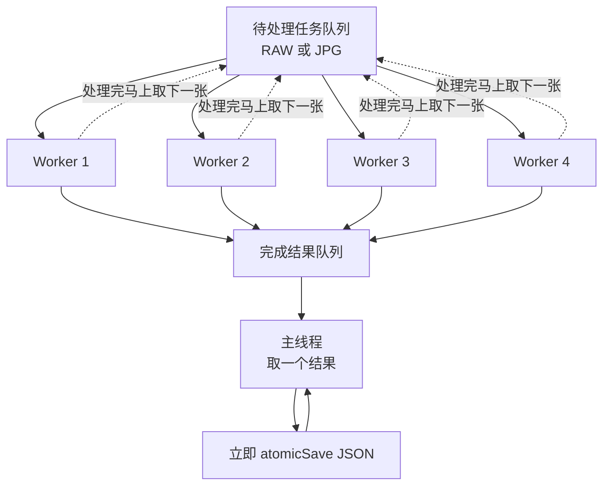
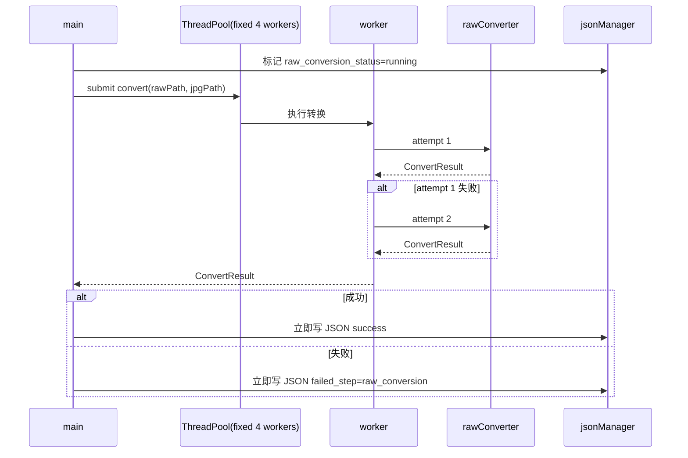
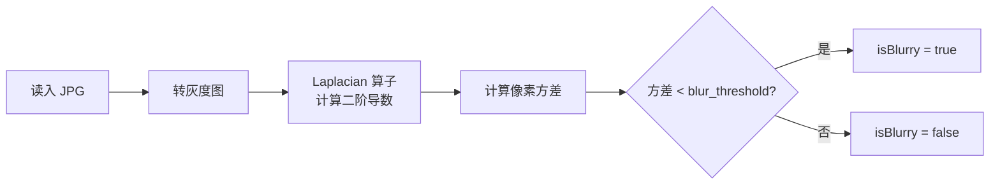
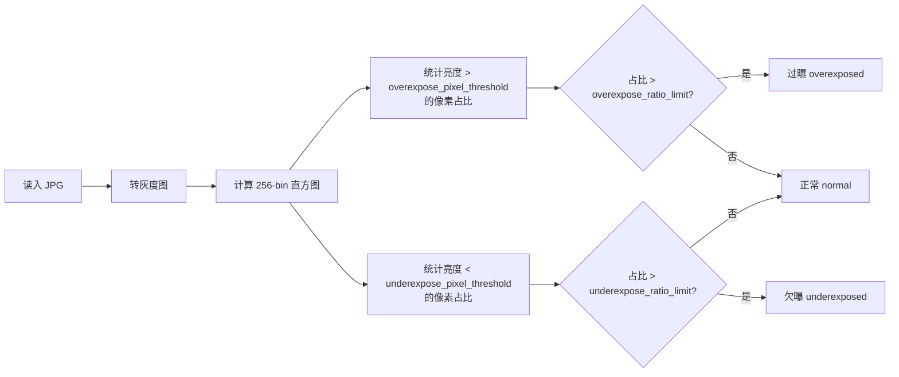

# Photo Analyzer — 技术设计文档

**Author:** wilbur  
**Version:** 1.7  
**Date:** 2026-06-01  
**Description:** C++ 照片批量分析工具技术方案，涵盖 Xcode 项目结构、模块划分、RAW 转换、图像分析、config.yaml 配置、JSON 持久化、失败重试、断点续跑和固定 4 worker 线程池策略。

---

## 1. 项目概述

一个基于 Xcode 构建的 macOS C++ 照片批量分析工具，接收一个文件夹路径，完成以下工作：

1. 扫描顶层目录内所有 `.JPG` / `.RW2`（松下）/ `.CR2`（佳能）文件，按文件名 stem 配对；
2. 读取 `config.yaml`，获得虚焦判断、曝光判断、RAW 转 JPG 质量等运行参数；
3. 读取 `<输入文件夹>/.cache/analysis.json`，判断哪些照片已经完成、哪些失败、哪些未开始；
4. 使用固定 4 个 worker 的线程池，并行将“只有 RAW、没有 JPG”的文件转换为 JPG；
5. RAW 转换任务失败时立即重试一次；如果第二次仍失败，则写入 JSON，标记失败阶段为 `raw_conversion`；
6. 使用固定 4 个 worker 的线程池，并行对待处理 JPG 做虚焦检测（拉普拉斯）和曝光检测（直方图）；
7. 图像分析任务失败时立即重试一次；如果第二次仍失败，则写入 JSON，标记失败阶段为 `analysis`；
8. 每个转换或分析任务一得到结果，就由主线程立即原子写入 `.cache/analysis.json`，避免程序中断导致全部结果丢失；
9. 程序再次启动时，只处理 JSON 中失败、未开始或上次中断停留在 `running` 状态的任务，已成功完成的任务跳过。

**JSON 路径：**

```text
<输入文件夹>/.cache/analysis.json
```

---

## 2. 当前项目目录结构

项目使用 Xcode 构建，第三方 C++ 库已放在根目录 `3rdPart/` 下。方案不再包含第三方库下载、安装或编译步骤。

```text
rawViewer/
├── .git/
├── .gitignore
├── config.yaml                 # 运行参数配置，使用 YAML 注释解释每个调参项
├── 3rdPart/                    # 已准备好的第三方 C++ 库目录
│   ├── json/                    # JSON 库源码或单头文件
│   ├── libraw/                  # LibRaw 头文件和库文件
│   ├── opencv/                  # OpenCV 头文件和库文件
│   ├── opencv-src/              # OpenCV 源码，仅保留参考或重新构建时使用
│   └── yaml/                    # yaml-cpp 头文件和库文件，用于读取 config.yaml
├── clip-vit-large-patch14/
├── cpp/                         # 新增：C++ 业务代码根目录
│   ├── main.cpp                 # 程序入口，仅负责参数解析和流程调度
│   ├── include/                 # 模块头文件
│   │   ├── fileScanner.h
│   │   ├── rawConverter.h
│   │   ├── imageAnalyzer.h
│   │   ├── jsonManager.h
│   │   ├── taskState.h
│   │   ├── threadPool.h
│   │   └── configLoader.h
│   └── src/                     # 模块实现文件
│       ├── fileScanner.cpp
│       ├── rawConverter.cpp
│       ├── imageAnalyzer.cpp
│       ├── jsonManager.cpp
│       ├── threadPool.cpp
│       └── configLoader.cpp
├── docs/
│   └── photo-analyzer-design.md
├── draft/
├── rawViewer/                   # 原 Xcode App 工程源目录
└── rawViewer.xcodeproj
```

**源码放置规则：**

- `cpp/main.cpp` 保留在 `cpp/` 根目录，只做入口、参数解析和流程调度；
- 模块头文件统一放入 `cpp/include/`；
- 模块实现文件统一放入 `cpp/src/`；
- Xcode target 中手动加入 `cpp/main.cpp` 和 `cpp/src/*.cpp`；
- Xcode Header Search Paths 指向 `cpp/include/` 和 `3rdPart/` 下对应 include 路径；
- Xcode Library Search Paths 指向 `3rdPart/` 下对应 lib 路径；
- 不在方案中维护 `CMakeLists.txt`、`build_deps.sh` 或 brew 安装步骤。

---

## 3. 依赖库与 Xcode 引用策略

### 3.1 依赖清单

| 库          | 用途                                     | 当前项目位置      | 说明                                 |
| ----------- | ---------------------------------------- | ----------------- | ------------------------------------ |
| OpenCV      | 图像读写、拉普拉斯、直方图               | `3rdPart/opencv/` | Xcode 直接引用已有头文件和库文件     |
| LibRaw      | 读取 `.RW2` / `.CR2` RAW 格式            | `3rdPart/libraw/` | Xcode 直接引用已有头文件和库文件     |
| yaml-cpp    | 读取 `config.yaml` 配置                  | `3rdPart/yaml/`   | 允许在 YAML 中写注释，方便解释调参项 |
| JSON C++ 库 | 读写 `analysis.json`，序列化、格式化输出 | `3rdPart/json/`   | 只负责结果持久化，不再负责配置读取   |

### 3.2 Xcode 配置原则

Xcode 工程需要配置：

| 配置项               | 建议内容                                                     |
| -------------------- | ------------------------------------------------------------ |
| Header Search Paths  | `$(PROJECT_DIR)/cpp/include`、`$(PROJECT_DIR)/3rdPart/json/**`、`$(PROJECT_DIR)/3rdPart/yaml/**`、`$(PROJECT_DIR)/3rdPart/opencv/**`、`$(PROJECT_DIR)/3rdPart/libraw/**`、`$(PROJECT_DIR)/3rdPart/yaml/**` |
| Library Search Paths | `$(PROJECT_DIR)/3rdPart/opencv/**`、`$(PROJECT_DIR)/3rdPart/libraw/**`、`$(PROJECT_DIR)/3rdPart/yaml/**` |
| Other Linker Flags   | 按当前 `3rdPart` 中实际 `.a` / `.dylib` 名称添加             |
| C++ Language Dialect | C++17 或更高                                                 |

> 具体 `.a` / `.dylib` 文件名以你本地 `3rdPart` 目录实际产物为准。本文档只约束项目结构和代码设计，不包含第三方库构建流程。

---

## 4. 整体流程



---

## 5. 核心状态设计

### 5.1 任务状态枚举

```cpp
/*
 * Author: wilbur
 * Version: 1.0
 * Date: 2026-05-29
 * Description: Defines persistent task status enums for resume and failure tracking.
 */

enum class StageStatus {
    Pending,      // 未开始，下一次需要处理
    Running,      // 已派发但尚未写入最终结果；下次启动按 Pending 处理
    Success,      // 已成功完成，下次启动跳过
    Failed,       // 已失败；下次启动可继续重试
    Skipped       // 不需要该阶段，例如原始 JPG 不需要 RAW 转换
};

enum class FailedStep {
    None,
    RawConversion,
    Analysis
};
```

### 5.2 单张照片持久化记录

每张照片以文件 stem 作为 key，例如 `IMG_0001`。这样断点续跑时不用遍历数组查找，也能避免同一张照片重复写入多条记录。

```cpp
/*
 * Author: wilbur
 * Version: 1.0
 * Date: 2026-05-29
 * Description: Defines persistent photo task state saved into analysis.json.
 */

struct PhotoTaskState {
    std::string photoId;              // 文件 stem，例如 IMG_0001
    std::string jpgPath;              // 原始 JPG 或 RAW 转换后的 JPG 路径
    std::string rawPath;              // RAW 路径，无则空字符串
    bool rawConverted;                // JPG 是否由 RAW 转换得到

    StageStatus rawConversionStatus;  // skipped / pending / running / success / failed
    StageStatus analysisStatus;       // pending / running / success / failed
    FailedStep failedStep;            // none / raw_conversion / analysis

    int rawConversionAttempts;        // 当前运行内最多 2 次
    int analysisAttempts;             // 当前运行内最多 2 次
    std::string rawConversionError;   // 最近一次 RAW 转换错误
    std::string analysisError;        // 最近一次分析错误

    bool isBlurry;
    double laplacianVariance;
    double laplacianMean;
    double laplacianStddev;
    double laplacianMin;
    double laplacianMax;
    int laplacianKernelSize;
    double blurThreshold;

    std::string exposureStatus;       // normal / overexposed / underexposed
    std::vector<int64_t> histogramBins; // 256-bin 灰度直方图原始计数
    int64_t totalPixels;
    int64_t overexposePixelCount;
    int64_t underexposePixelCount;
    double histOverexposeRatio;
    double histUnderexposeRatio;
    int overexposePixelThreshold;
    int underexposePixelThreshold;
    double overexposeRatioLimit;
    double underexposeRatioLimit;

    std::string createdAt;            // 首次写入时间
    std::string updatedAt;            // 最近更新时间
};
```

---

## 6. 模块设计

### 6.1 fileScanner

**职责：** 扫描顶层目录，收集文件，按 stem 配对，输出扫描结果。



**输出数据结构：**

```cpp
/*
 * Author: wilbur
 * Version: 1.0
 * Date: 2026-05-29
 * Description: Defines scanned photo file pair information.
 */

struct PhotoPair {
    std::string photoId;       // 文件 stem
    std::string jpgPath;       // JPG 完整路径；RAW-only 初始为空
    std::string rawPath;       // RAW 完整路径；无则空字符串
    bool hasJpg;
    bool hasRaw;
};
```

---

### 6.2 jsonManager

**职责：** 读取、合并、更新、原子写入 `.cache/analysis.json`。



**写入策略：**

- JSON 由主线程串行写入，worker 不直接写文件；
- 每次扫描后先写入一次，把新增照片标记为 `pending`；
- 每个 RAW 转换任务完成后立即写一次；
- 每个图像分析任务完成后立即写一次；
- 每次写入使用临时文件 + `rename`：

```text
.cache/analysis.json.tmp -> .cache/analysis.json
```

- 如果程序在写入中断，正式文件仍保留上一次完整 JSON；
- 如果上次运行留下 `running` 状态，本次启动统一视为 `pending` 继续处理；
- `success` 状态的任务默认跳过；
- `failed` 状态的任务下次启动重新进入待处理队列，但 JSON 会保留上一次失败原因。

---

### 6.3 resumePlanner

**职责：** 根据扫描结果和 JSON 状态表生成本次需要执行的任务队列。

#### RAW 转换任务选择规则

| 条件                               | 本次是否转换                               |
| ---------------------------------- | ------------------------------------------ |
| `raw_conversion_status == success` | 否                                         |
| `raw_conversion_status == skipped` | 否                                         |
| `raw_conversion_status == pending` | 是                                         |
| `raw_conversion_status == running` | 是，视为上次中断                           |
| `raw_conversion_status == failed`  | 是，允许本次重新尝试                       |
| 照片已有原始 JPG                   | 否，标记 `raw_conversion_status = skipped` |
| 照片只有 RAW，没有 JPG             | 是                                         |

#### 图像分析任务选择规则

| 条件                         | 本次是否分析                                 |
| ---------------------------- | -------------------------------------------- |
| `analysis_status == success` | 否                                           |
| `analysis_status == pending` | 是                                           |
| `analysis_status == running` | 是，视为上次中断                             |
| `analysis_status == failed`  | 是，允许本次重新尝试                         |
| RAW 转换失败且没有可分析 JPG | 否，等待 RAW 转换后再分析                    |
| JPG 文件不存在               | 否，标记 `failed_step = analysis` 并记录错误 |

---

### 6.4 threadPool

**职责：** 提供固定 4 个 worker 的持续消费型线程池。RAW 转换阶段和图像分析阶段都使用同一套线程池模型。

**核心要求：**

- 每个阶段启动后创建 **4 个常驻 worker 线程**；
- 所有待处理任务进入一个共享任务队列；
- worker 不按“批次”分配照片，也不等待某一批全部完成；
- 任意 worker 处理完当前照片后，立即从共享队列取下一张继续处理；
- 只要队列中还有任务，并且阶段未结束，就尽量保持 4 个 worker 持续运行；
- 任务结果进入完成结果队列，由主线程逐条取出并立即写 JSON；
- 主线程写 JSON 时，worker 不需要等待整个阶段完成，可以继续处理队列中的下一个任务。



**并发约束：**

- RAW 转换阶段固定 4 个 worker；
- 图像分析阶段固定 4 个 worker；
- 这不是“每 4 张一批，等这一批全部结束再处理下一批”；
- 正确模型是“4 个 worker + 共享队列 + 谁空闲谁取下一项”；
- 如果待处理任务少于 4 个，则只会有实际任务数量个 worker 忙碌；
- 如果待处理任务大于 4 个，则任意时刻最多 4 个任务并行。

**建议接口：**

```cpp
/*
 * Author: wilbur
 * Version: 1.0
 * Date: 2026-05-29
 * Description: Provides a fixed four-worker queue-based thread pool.
 */

template <typename Task, typename Result>
class ThreadPool {
public:
    using TaskHandler = std::function<Result(const Task&)>;

    explicit ThreadPool(TaskHandler handler);
    ~ThreadPool();

    void pushTask(const Task& task);
    bool tryPopResult(Result& result);
    void waitUntilFinished();
    void stop();
};
```

**设计原则：**

- 不使用“每个文件一个 `std::async`”的无界派发方式；
- 不使用“固定 4 个一组”的批处理方式；
- worker 只处理转换或分析，不直接写 JSON；
- 主线程负责接收完成结果、更新内存状态、立即原子写入 JSON；
- RAW 转换阶段和图像分析阶段可以分别创建一个 4-worker 线程池，阶段结束后销毁。

> **技术约束：worker 线程栈必须 ≥ 8 MB**
>
> macOS 给非主线程默认栈只有 512 KB。LibRaw 解码 + OpenCV JPEG encoder + `std::function`
> 调用链实测栈峰值约 500 KB ~ 1 MB，512 KB 必爆。`ThreadPool` 必须用 `pthread` API 显式
> `pthread_attr_setstacksize(&attr, 8 * 1024 * 1024)` 创建 worker。
>
> 相关代码：
> - `cpp/include/threadPool.h` 中 `static constexpr size_t kWorkerStackSize = 8 * 1024 * 1024;`
>
> 详细 BUG 定位：`docs/20260601_worker_thread_stack_overflow.md`。

---

### 6.5 rawConverter

**职责：** 使用 LibRaw 将 RAW 文件解码，用 OpenCV 保存为 JPG。每个 worker 内部独立创建 LibRaw 实例。



**失败处理：**

- 第一次转换失败后，worker 内部立即重试一次；
- 第二次仍失败，返回失败结果；
- JSON 中记录：
  - `raw_conversion_status = "failed"`
  - `analysis_status = "pending"` 或保持原状态，但没有 JPG 时不会进入分析队列
  - `failed_step = "raw_conversion"`
  - `raw_conversion_attempts = 2`
  - `raw_conversion_error = "最近一次错误信息"`

---

### 6.6 imageAnalyzer

**职责：** 对单张 JPG 执行虚焦检测和曝光检测，返回结构化结果。

**配置来源：**

- 虚焦判断阈值从 `config.yaml` 的 `blur_detection.laplacian_threshold` 读取；
- 拉普拉斯核大小从 `config.yaml` 的 `blur_detection.laplacian_kernel_size` 读取；
- 过曝/欠曝判断参数从 `config.yaml` 的 `exposure_detection` 读取；
- 每张照片分析成功后，需要把本次使用的配置写入 `analysis_config_snapshot`，避免以后修改配置后无法复查旧结果；
- 每张照片分析成功后，需要把拉普拉斯原始统计值和 256-bin 灰度直方图原始计数写入 `analysis_raw_data`。


#### 拉普拉斯虚焦检测原理



#### 直方图曝光检测原理



**输出数据要求：**

图像分析成功时必须返回以下三类数据：

1. **判断结果**：`is_blurry`、`exposure_status`；
2. **配置快照**：本次判断使用的虚焦阈值、曝光阈值、比例上限；
3. **原始分析数据**：拉普拉斯统计值和 256-bin 灰度直方图计数。

拉普拉斯不建议把整张二阶导数图的每个像素都写入 JSON，因为图片越大 JSON 会膨胀越严重。方案中保存的是可复查判断所需的原始统计数据：`variance`、`mean`、`stddev`、`min`、`max`、`kernel_size`。直方图则保存完整 `256` 个 bin 的原始像素计数。

**失败处理：**

- 第一次分析失败后，worker 内部立即重试一次；
- 第二次仍失败，返回失败结果；
- JSON 中记录：
  - `analysis_status = "failed"`
  - `failed_step = "analysis"`
  - `analysis_attempts = 2`
  - `analysis_error = "最近一次错误信息"`

---

## 7. JSON 数据结构定义

**JSON 路径：** `<输入文件夹>/.cache/analysis.json`  
**根节点类型：** object  
**写入方式：** 每次任务完成后原子覆盖整个 JSON 文件。

### 7.1 顶层结构

| 字段名           | 类型   | 说明                                  |
| ---------------- | ------ | ------------------------------------- |
| `schema_version` | string | JSON 结构版本，当前为 `1.3`           |
| `folder_path`    | string | 输入文件夹绝对路径                    |
| `created_at`     | string | JSON 首次创建时间，ISO8601 UTC 时间戳 |
| `updated_at`     | string | 最近一次写入时间，ISO8601 UTC 时间戳  |
| `max_workers`    | number | 当前固定并发 worker 数，值为 `4`      |
| `config_path`    | string | 本次运行读取的 `config.yaml` 路径     |
| `summary`        | object | 当前 JSON 中所有照片的状态统计        |
| `photos`         | object | 以照片 stem 为 key 的照片状态表       |

### 7.2 summary 结构

| 字段名                   | 类型   | 说明                   |
| ------------------------ | ------ | ---------------------- |
| `total_photos`           | number | 扫描到的照片 stem 数量 |
| `raw_conversion_success` | number | RAW 转换成功数量       |
| `raw_conversion_failed`  | number | RAW 转换失败数量       |
| `analysis_success`       | number | 分析成功数量           |
| `analysis_failed`        | number | 分析失败数量           |
| `pending`                | number | 仍需继续处理的数量     |
| `blurry`                 | number | 判定为虚焦的数量       |
| `overexposed`            | number | 判定为过曝的数量       |
| `underexposed`           | number | 判定为欠曝的数量       |
| `normal`                 | number | 曝光状态为正常的数量   |

### 7.3 photos 元素结构

| 字段名                     | 类型           | 说明                                                     |
| -------------------------- | -------------- | -------------------------------------------------------- |
| `photo_id`                 | string         | 文件 stem，例如 `IMG_0001`                               |
| `file_name`                | string / null  | JPG 文件名；RAW-only 且尚未转换成功时为 `null`           |
| `file_path`                | string / null  | JPG 完整路径；RAW-only 且尚未转换成功时为 `null`         |
| `raw_file_name`            | string / null  | 对应 RAW 文件名；无 RAW 时为 `null`                      |
| `raw_file_path`            | string / null  | RAW 完整路径；无 RAW 时为 `null`                         |
| `raw_converted`            | boolean        | `true` = JPG 由 RAW 转换而来                             |
| `raw_conversion_status`    | string         | `pending` / `running` / `success` / `failed` / `skipped` |
| `analysis_status`          | string         | `pending` / `running` / `success` / `failed`             |
| `failed_step`              | string         | `none` / `raw_conversion` / `analysis`                   |
| `raw_conversion_attempts`  | number         | 当前运行内 RAW 转换尝试次数，最大 2                      |
| `analysis_attempts`        | number         | 当前运行内分析尝试次数，最大 2                           |
| `raw_conversion_error`     | string / null  | 最近一次 RAW 转换错误                                    |
| `analysis_error`           | string / null  | 最近一次分析错误                                         |
| `is_blurry`                | boolean / null | 是否虚焦，分析成功后写入                                 |
| `exposure_status`          | string / null  | `normal` / `overexposed` / `underexposed`                |
| `analysis_config_snapshot` | object / null  | 本张照片分析时使用的 `config.yaml` 判断参数快照          |
| `analysis_raw_data`        | object / null  | 本张照片的拉普拉斯和直方图原始分析数据                   |
| `created_at`               | string         | 当前照片记录首次创建时间                                 |
| `updated_at`               | string         | 当前照片记录最近更新时间                                 |

### 7.4 analysis_config_snapshot 结构

该对象保存“本张照片分析时实际使用的判断参数”。这些参数来自 `config.yaml`。即使之后修改了配置，也能通过 JSON 复查旧结果。

| 字段名                                           | 类型   | 说明                         |
| ------------------------------------------------ | ------ | ---------------------------- |
| `blur_detection.laplacian_threshold`             | number | 低于该值判定为虚焦           |
| `blur_detection.laplacian_kernel_size`           | number | 拉普拉斯核大小               |
| `exposure_detection.overexpose_pixel_threshold`  | number | 亮度大于该值计入高亮像素     |
| `exposure_detection.underexpose_pixel_threshold` | number | 亮度小于该值计入暗部像素     |
| `exposure_detection.overexpose_ratio_limit`      | number | 高亮像素占比超过该值判定过曝 |
| `exposure_detection.underexpose_ratio_limit`     | number | 暗部像素占比超过该值判定欠曝 |

### 7.5 analysis_raw_data 结构

该对象保存“本张照片的原始分析数据”。

| 字段名      | 类型   | 说明                     |
| ----------- | ------ | ------------------------ |
| `laplacian` | object | 拉普拉斯分析原始统计数据 |
| `histogram` | object | 灰度直方图原始数据       |

**`laplacian` 字段：**

| 字段名        | 类型   | 说明                       |
| ------------- | ------ | -------------------------- |
| `variance`    | number | 拉普拉斯方差，用于虚焦判断 |
| `mean`        | number | 拉普拉斯结果均值           |
| `stddev`      | number | 拉普拉斯结果标准差         |
| `min`         | number | 拉普拉斯结果最小值         |
| `max`         | number | 拉普拉斯结果最大值         |
| `kernel_size` | number | 本次计算使用的核大小       |

**`histogram` 字段：**

| 字段名                    | 类型     | 说明                                                |
| ------------------------- | -------- | --------------------------------------------------- |
| `bin_count`               | number   | 固定为 `256`                                        |
| `bins`                    | number[] | 长度为 256 的灰度直方图原始计数，索引即亮度值 0~255 |
| `total_pixels`            | number   | 灰度图总像素数                                      |
| `overexpose_pixel_count`  | number   | 高亮像素数量                                        |
| `underexpose_pixel_count` | number   | 暗部像素数量                                        |
| `overexpose_ratio`        | number   | 高亮像素占比                                        |
| `underexpose_ratio`       | number   | 暗部像素占比                                        |

### 7.6 JSON 示例

```json
{
  "schema_version": "1.3",
  "folder_path": "/Users/wilbur/Pictures/test",
  "config_path": "/Users/wilbur/project/rawViewer/config.yaml",
  "created_at": "2026-05-29T14:30:00Z",
  "updated_at": "2026-05-29T14:36:10Z",
  "max_workers": 4,
  "summary": {
    "total_photos": 3,
    "raw_conversion_success": 1,
    "raw_conversion_failed": 1,
    "analysis_success": 1,
    "analysis_failed": 1,
    "pending": 1,
    "blurry": 0,
    "overexposed": 0,
    "underexposed": 0,
    "normal": 1
  },
  "photos": {
    "IMG_0001": {
      "photo_id": "IMG_0001",
      "file_name": "IMG_0001.JPG",
      "file_path": "/Users/wilbur/Pictures/test/IMG_0001.JPG",
      "raw_file_name": "IMG_0001.CR2",
      "raw_file_path": "/Users/wilbur/Pictures/test/IMG_0001.CR2",
      "raw_converted": false,
      "raw_conversion_status": "skipped",
      "analysis_status": "success",
      "failed_step": "none",
      "raw_conversion_attempts": 0,
      "analysis_attempts": 1,
      "raw_conversion_error": null,
      "analysis_error": null,
      "is_blurry": false,
      "exposure_status": "normal",
      "analysis_config_snapshot": {
        "blur_detection": {
          "laplacian_threshold": 100.0,
          "laplacian_kernel_size": 3
        },
        "exposure_detection": {
          "overexpose_pixel_threshold": 245,
          "underexpose_pixel_threshold": 10,
          "overexpose_ratio_limit": 0.05,
          "underexpose_ratio_limit": 0.05
        }
      },
      "analysis_raw_data": {
        "laplacian": {
          "variance": 182.43,
          "mean": 0.12,
          "stddev": 13.51,
          "min": -148.0,
          "max": 171.0,
          "kernel_size": 3
        },
        "histogram": {
          "bin_count": 256,
          "bins": [
            12, 18, 24, 39, 51, 63, 72, 81,
            95, 104, 116, 130, 142, 155, 169, 181,
            196, 210, 225, 240, 260, 281, 300, 322,
            345, 369, 394, 420, 447, 475, 504, 534,
            565, 597, 630, 664, 699, 735, 772, 810,
            849, 889, 930, 972, 1015, 1059, 1104, 1150,
            1197, 1245, 1294, 1344, 1395, 1447, 1500, 1554,
            1609, 1665, 1722, 1780, 1839, 1899, 1960, 2022,
            2085, 2149, 2214, 2280, 2347, 2415, 2484, 2554,
            2625, 2697, 2770, 2844, 2919, 2995, 3072, 3150,
            3229, 3309, 3390, 3472, 3555, 3639, 3724, 3810,
            3897, 3985, 4074, 4164, 4255, 4347, 4440, 4534,
            4629, 4725, 4822, 4920, 5019, 5119, 5220, 5322,
            5425, 5529, 5634, 5740, 5847, 5955, 6064, 6174,
            6285, 6397, 6510, 6624, 6739, 6855, 6972, 7090,
            7209, 7329, 7450, 7572, 7695, 7819, 7944, 8070,
            8197, 8070, 7944, 7819, 7695, 7572, 7450, 7329,
            7209, 7090, 6972, 6855, 6739, 6624, 6510, 6397,
            6285, 6174, 6064, 5955, 5847, 5740, 5634, 5529,
            5425, 5322, 5220, 5119, 5019, 4920, 4822, 4725,
            4629, 4534, 4440, 4347, 4255, 4164, 4074, 3985,
            3897, 3810, 3724, 3639, 3555, 3472, 3390, 3309,
            3229, 3150, 3072, 2995, 2919, 2844, 2770, 2697,
            2625, 2554, 2484, 2415, 2347, 2280, 2214, 2149,
            2085, 2022, 1960, 1899, 1839, 1780, 1722, 1665,
            1609, 1554, 1500, 1447, 1395, 1344, 1294, 1245,
            1197, 1150, 1104, 1059, 1015, 972, 930, 889,
            849, 810, 772, 735, 699, 664, 630, 597,
            565, 534, 504, 475, 447, 420, 394, 369,
            345, 322, 300, 281, 260, 240, 225, 210,
            196, 181, 169, 155, 142, 130, 116, 104,
            95, 81, 72, 63, 51, 39, 24, 18
          ],
          "total_pixels": 921600,
          "overexpose_pixel_count": 11059,
          "underexpose_pixel_count": 16589,
          "overexpose_ratio": 0.012,
          "underexpose_ratio": 0.018
        }
      },
      "created_at": "2026-05-29T14:30:00Z",
      "updated_at": "2026-05-29T14:31:00Z"
    },
    "IMG_0002": {
      "photo_id": "IMG_0002",
      "file_name": "IMG_0002.JPG",
      "file_path": "/Users/wilbur/Pictures/test/.cache/converted/IMG_0002.JPG",
      "raw_file_name": "IMG_0002.RW2",
      "raw_file_path": "/Users/wilbur/Pictures/test/IMG_0002.RW2",
      "raw_converted": true,
      "raw_conversion_status": "success",
      "analysis_status": "failed",
      "failed_step": "analysis",
      "raw_conversion_attempts": 1,
      "analysis_attempts": 2,
      "raw_conversion_error": null,
      "analysis_error": "OpenCV failed to read converted JPG",
      "is_blurry": null,
      "exposure_status": null,
      "analysis_config_snapshot": null,
      "analysis_raw_data": null,
      "created_at": "2026-05-29T14:30:00Z",
      "updated_at": "2026-05-29T14:32:00Z"
    },
    "IMG_0003": {
      "photo_id": "IMG_0003",
      "file_name": null,
      "file_path": null,
      "raw_file_name": "IMG_0003.CR2",
      "raw_file_path": "/Users/wilbur/Pictures/test/IMG_0003.CR2",
      "raw_converted": false,
      "raw_conversion_status": "failed",
      "analysis_status": "pending",
      "failed_step": "raw_conversion",
      "raw_conversion_attempts": 2,
      "analysis_attempts": 0,
      "raw_conversion_error": "LibRaw unpack failed",
      "analysis_error": null,
      "is_blurry": null,
      "exposure_status": null,
      "analysis_config_snapshot": null,
      "analysis_raw_data": null,
      "created_at": "2026-05-29T14:30:00Z",
      "updated_at": "2026-05-29T14:33:00Z"
    }
  }
}
```

---

## 8. config.yaml 结构

`config.yaml` 放在项目根目录，或通过命令行 `--config` 指定。虚焦和曝光判断必须从这份配置中读取，不能硬编码在代码里。

使用 YAML 的原因是：配置文件需要直接面向调参，必须能在每个参数旁边写注释，说明参数意义、推荐范围和调大/调小后的影响。`analysis.json` 仍然只用于保存分析结果和断点续跑状态。

```yaml
# Photo Analyzer runtime config
# 所有阈值都会在每张照片分析成功后写入 analysis_config_snapshot，
# 这样以后即使修改本文件，也能复查当时的判断依据。

blur_detection:
  # 拉普拉斯方差阈值。
  # variance < laplacian_threshold 时判定为虚焦。
  # 调大：更容易判定为虚焦；调小：更宽松。
  laplacian_threshold: 100.0

  # 拉普拉斯核大小，只允许正奇数，建议 3。
  # 值越大，对边缘变化更敏感，但也可能放大噪声。
  laplacian_kernel_size: 3

exposure_detection:
  # 高亮像素阈值。
  # 灰度亮度 > 该值的像素会计入高亮像素。
  # 取值范围 0~255，建议先用 245。
  overexpose_pixel_threshold: 245

  # 暗部像素阈值。
  # 灰度亮度 < 该值的像素会计入暗部像素。
  # 取值范围 0~255，建议先用 10。
  underexpose_pixel_threshold: 10

  # 过曝比例阈值。
  # 高亮像素占比 > 该值时判定为过曝。
  # 0.05 表示超过 5% 像素属于高亮区域。
  overexpose_ratio_limit: 0.05

  # 欠曝比例阈值。
  # 暗部像素占比 > 该值时判定为欠曝。
  # 0.05 表示超过 5% 像素属于暗部区域。
  underexpose_ratio_limit: 0.05

raw_conversion:
  # RAW 转 JPG 的输出质量。
  # 取值范围 0~100；值越高文件越大、细节保留越多。
  jpg_quality: 95

thread_pool:
  # 固定 worker 数。
  # 当前方案强制使用 4 个 worker。
  # 这里保留配置项主要是为了让运行参数显式可见；
  # 即使这里改成其他数字，执行层仍按 4 个 worker 运行。
  worker_count: 4
```

### 8.1 字段说明

| 字段                                             | 类型   | 说明                                                         |
| ------------------------------------------------ | ------ | ------------------------------------------------------------ |
| `blur_detection.laplacian_threshold`             | number | 拉普拉斯方差低于该值时判定为虚焦；调大更严格，调小更宽松     |
| `blur_detection.laplacian_kernel_size`           | number | 拉普拉斯计算核大小，只允许正奇数，建议为 `3`                 |
| `exposure_detection.overexpose_pixel_threshold`  | number | 灰度亮度大于该值的像素视为高亮像素，取值范围 `0~255`         |
| `exposure_detection.underexpose_pixel_threshold` | number | 灰度亮度小于该值的像素视为暗部像素，取值范围 `0~255`         |
| `exposure_detection.overexpose_ratio_limit`      | number | 高亮像素占比超过该值时判定为过曝                             |
| `exposure_detection.underexpose_ratio_limit`     | number | 暗部像素占比超过该值时判定为欠曝                             |
| `raw_conversion.jpg_quality`                     | number | RAW 转 JPG 的压缩质量，范围 `0~100`                          |
| `thread_pool.worker_count`                       | number | 当前固定为 `4`；如果配置缺失或不是 `4`，程序仍按 4 个 worker 执行 |

### 8.2 配置读取规则

- `configLoader` 使用 `3rdPart/yaml` 中的 yaml-cpp 读取 `config.yaml`；
- 程序启动时必须先读取并校验 `config.yaml`；
- 虚焦与曝光判断参数不得写死在 `imageAnalyzer` 中；
- 每张照片分析成功后，把实际使用的判断参数写入该照片的 `analysis_config_snapshot`；
- 如果 `config.yaml` 缺少必要字段，程序应直接报错退出，不使用隐藏默认值；
- `thread_pool.worker_count` 当前只作为配置可见性字段，执行层固定使用 4 个 worker；
- `analysis.json` 中只保存配置快照和分析结果，不作为运行参数配置文件。

---

## 9. 命令行接口

```bash
# 基础用法
./rawViewer /path/to/photos

# 可选：指定 config 路径
./rawViewer /path/to/photos --config /path/to/config.yaml

# 可选：重新处理失败项和未完成项；默认行为就是断点续跑
./rawViewer /path/to/photos --resume
```

**输出示例：**

```text
[Scan]    Found 120 JPG, 98 RAW (95 paired, 3 RAW-only, 25 JPG-only)
[JSON]    Loaded /path/to/photos/.cache/analysis.json
[Resume]  Skip success: 110, pending: 8, failed retry: 5
[Convert] Converting 3 RAW files (fixed 4 workers)...
[Convert] IMG_0201.RW2 success, JSON saved
[Convert] IMG_0202.CR2 failed after 2 attempts, JSON saved
[Analyze] Analyzing 13 JPG files (fixed 4 workers)...
[Analyze] IMG_0008.JPG success, JSON saved
[Analyze] IMG_0012.JPG failed after 2 attempts, JSON saved
[JSON]    Updated /path/to/photos/.cache/analysis.json

Summary:
  Total photos            : 123
  Analysis success        : 118
  Analysis failed         : 2
  Pending                 : 3
  Blurry                  : 12
  Overexposed             : 5
  Underexposed            : 8
  Normal                  : 93
```

---

## 10. 断点续跑策略

### 10.1 启动时处理

1. 扫描当前输入目录，得到最新的 JPG/RAW 文件集合；
2. 读取 `.cache/analysis.json`；
3. 如果 JSON 不存在，则创建空 JSON；
4. 将扫描结果合并进 JSON：
   - 新照片创建记录；
   - 已存在照片保留原状态；
   - 文件路径变化时更新路径；
5. 把上次遗留的 `running` 状态改回 `pending`；
6. 生成 RAW 转换队列和图像分析队列。

### 10.2 跳过规则

| 状态               | 行为                       |
| ------------------ | -------------------------- |
| RAW 转换 `success` | 跳过转换                   |
| RAW 转换 `skipped` | 跳过转换                   |
| 分析 `success`     | 跳过分析                   |
| 任一阶段 `failed`  | 本次继续处理               |
| 任一阶段 `pending` | 本次继续处理               |
| 任一阶段 `running` | 视为上次中断，本次继续处理 |

### 10.3 失败重试规则

| 场景                   | 行为                                |
| ---------------------- | ----------------------------------- |
| RAW 转换第一次失败     | 立即重试一次                        |
| RAW 转换第二次失败     | 写入 `failed_step = raw_conversion` |
| 图像分析第一次失败     | 立即重试一次                        |
| 图像分析第二次失败     | 写入 `failed_step = analysis`       |
| 程序重启后发现 failed  | 重新放入本次处理队列                |
| 程序重启后发现 running | 视为 pending，重新处理              |

---

## 11. 即时写 JSON 的一致性设计

为了防止“所有照片都分析完才写 JSON，程序中途崩溃导致结果全部丢失”，本方案采用 **主线程即时持久化**：

1. worker 完成一个任务后返回结果；
2. 主线程立即把该结果合并进内存中的 JSON 状态；
3. 主线程调用 `jsonManager.atomicSave()`；
4. 写入 `.cache/analysis.json.tmp`；
5. `rename` 覆盖 `.cache/analysis.json`；
6. 再处理下一个完成结果。

**不允许：**

- worker 线程直接写 JSON；
- 多线程同时写同一个 JSON 文件；
- 等所有分析完成后才统一写 JSON；
- 直接覆盖正式 JSON 文件而不使用临时文件。

---

## 12. 文件命名与代码规范

- 所有源文件按**小驼峰**命名：`fileScanner.cpp`、`rawConverter.h`；
- 所有变量、函数按**小驼峰**命名；
- `cpp/main.cpp` 放在根目录 `cpp/` 下；
- 模块头文件统一放在 `cpp/include/`；
- 模块实现文件统一放在 `cpp/src/`；
- 每个源文件包含标准文件头：

```cpp
/*
 * Author: wilbur
 * Version: 1.0
 * Date: 2026-05-29
 * Description: xxxx
 */
```

- 版本号规则：初始 1.0，每次修改递增小版本（1.0 → 1.1），用户明确要求时才升主版本。

---

## 13. 已知限制与后续扩展点

| 限制                             | 说明                                                         |
| -------------------------------- | ------------------------------------------------------------ |
| 仅支持顶层目录                   | 不递归扫描子目录，当前设计如此                               |
| 仅支持松下 RW2 / 佳能 CR2        | 其他 RAW 格式暂不支持                                        |
| 曝光检测基于灰度                 | 未考虑 RAW 色彩空间的过曝                                    |
| JSON 每次完整覆盖                | 为保证合法 JSON 和断点续跑，当前每次结果更新都会原子覆盖整个 JSON；超大目录后续可考虑 JSON Lines 或分片 JSON |
| failed 会在下次启动继续处理      | 如果文件永久损坏，每次启动都会再次尝试并重新写入失败原因     |
| Xcode 链接配置依赖本地实际文件名 | 本方案只规定 `3rdPart` 目录引用原则，不枚举本地 `.a` / `.dylib` 具体文件名 |
| JSON 保存完整 256-bin 直方图     | 这是为了保留可复查的原始直方图数据；如果后续数据量过大，可考虑压缩或拆分每张照片的 JSON |
