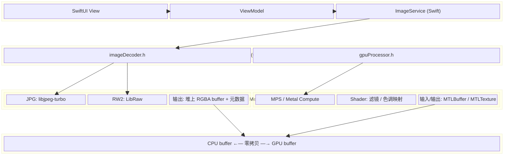
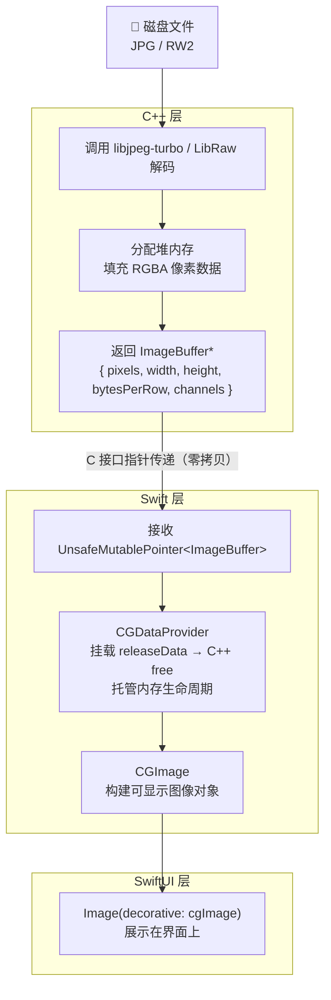
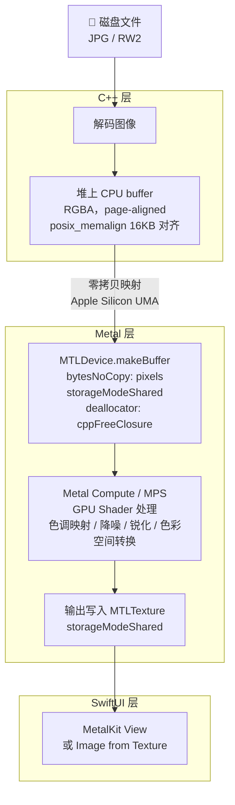
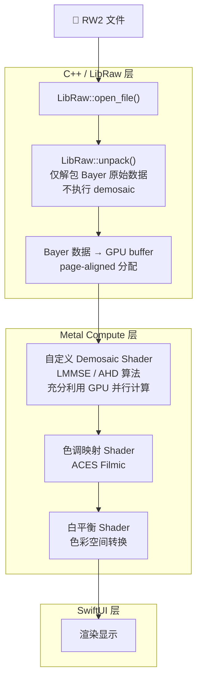
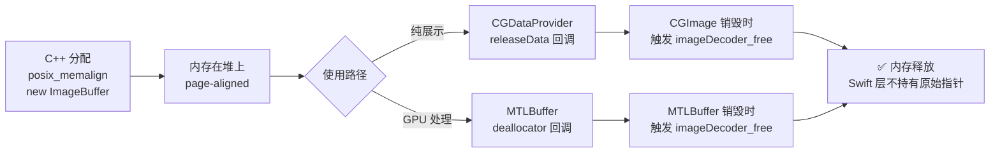
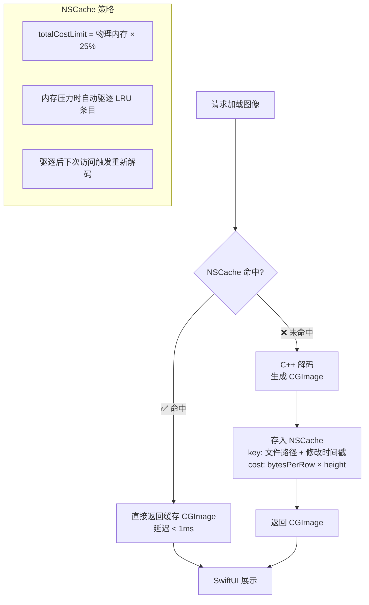
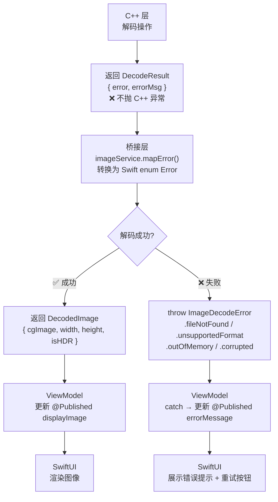
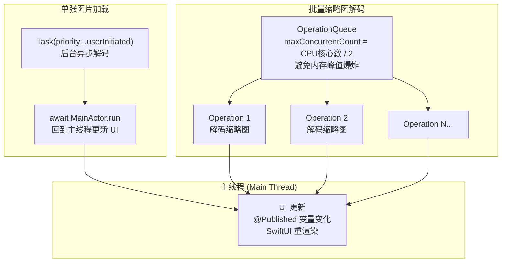

# Swift + C++ macOS 图像处理 App 架构方案

**Author:** wilbur  
**Version:** 1.1  
**Date:** 2026-05-29  
**Description:** 将所有 ASCII 流程图/架构图替换为 Mermaid 图表，包括整体架构、三条数据流路径、内存所有权、缓存策略、错误处理、并发调度共 7 张图。

---

## 目录

1. [整体架构概览](#1-整体架构概览)
2. [数据流详解](#2-数据流详解)
3. [工程结构](#3-工程结构)
4. [C++ 层设计](#4-c-层设计)
5. [Swift-C++ 桥接层设计](#5-swift-c-桥接层设计)
6. [Swift 层设计](#6-swift-层设计)
7. [Metal GPU 加速路径](#7-metal-gpu-加速路径)
8. [内存管理策略](#8-内存管理策略)
9. [错误处理机制](#9-错误处理机制)
10. [性能关键点](#10-性能关键点)
11. [依赖库选型](#11-依赖库选型)
12. [分阶段实施计划](#12-分阶段实施计划)

---

## 1. 整体架构概览



**三层职责划分：**

| 层级 | 语言 | 职责 |
|------|------|------|
| UI + 业务层 | Swift / SwiftUI | 界面渲染、用户交互、业务状态管理 |
| 桥接层 | C 接口头文件 | Swift 与 C++ 的 ABI 边界，纯 C 结构体和函数声明 |
| 图像处理层 | C++ | 图像解码（JPG/RW2）、GPU 算法、内存管理 |

---

## 2. 数据流详解

### 2.1 基础展示路径（无 GPU 处理）



### 2.2 GPU 加速处理路径（M 系列芯片推荐路径）



### 2.3 RW2 RAW 格式专用流程



---

## 3. 工程结构

```
MyPhotoApp/
├── MyPhotoApp.xcodeproj
│
├── App/                          # Swift 入口
│   ├── myPhotoApp.swift
│   └── contentView.swift
│
├── UI/                           # SwiftUI 视图层
│   ├── imageViewer.swift
│   ├── thumbnailGrid.swift
│   └── metalImageView.swift      # MTKView 封装
│
├── ViewModel/                    # Swift 业务逻辑
│   ├── imageViewModel.swift
│   └── imageService.swift        # 调用桥接接口
│
├── Bridge/                       # 桥接层（纯 C 接口）
│   ├── imageDecoder.h            # C 结构体 + 函数声明
│   ├── gpuProcessor.h
│   └── MyPhotoApp-Bridging-Header.h
│
├── Core/                         # C++ 核心层
│   ├── decoder/
│   │   ├── imageDecoder.cpp      # 统一解码入口
│   │   ├── jpegDecoder.cpp       # libjpeg-turbo 封装
│   │   └── rawDecoder.cpp        # LibRaw 封装
│   ├── gpu/
│   │   ├── gpuProcessor.cpp      # Metal 处理调度
│   │   └── metalBridge.mm        # ObjC++ Metal API 调用
│   └── utils/
│       └── memoryUtils.cpp
│
├── Shaders/                      # Metal Shader
│   ├── demosaic.metal
│   ├── toneMapping.metal
│   └── colorTransform.metal
│
└── Vendor/                       # 第三方库（SPM / XCFramework）
    ├── libjpeg-turbo/
    └── LibRaw/
```

---

## 4. C++ 层设计

### 4.1 核心数据结构（Bridge 头文件）

```c
// Bridge/imageDecoder.h
// 纯 C 结构体，Swift/C++ 均可直接使用

#pragma once
#include <stdint.h>
#include <stdbool.h>

// 像素格式枚举
typedef enum {
    pixelFormatRGBA8 = 0,
    pixelFormatRGB8  = 1,
    pixelFormatRGBA16 = 2,    // 16-bit，RAW 高精度场景
} PixelFormat;

// 图像 buffer 结构体（C++ 填充，Swift 读取）
typedef struct {
    uint8_t*    pixels;        // 堆上像素数据（page-aligned）
    int32_t     width;
    int32_t     height;
    int32_t     bytesPerRow;
    int32_t     channels;
    PixelFormat pixelFormat;
    bool        isHDR;         // 是否为 16-bit HDR 数据
} ImageBuffer;

// 解码错误码
typedef enum {
    decodeSuccess       = 0,
    decodeFileNotFound  = 1,
    decodeUnsupported   = 2,
    decodeOutOfMemory   = 3,
    decodeCorrupted     = 4,
} DecodeError;

// 解码结果（避免通过返回值传指针）
typedef struct {
    ImageBuffer* buffer;      // 成功时非 NULL
    DecodeError  error;
    char         errorMsg[256];
} DecodeResult;

// C 接口函数声明
#ifdef __cplusplus
extern "C" {
#endif

DecodeResult imageDecoder_decode(const char* filePath);
void         imageDecoder_free(ImageBuffer* buffer);

#ifdef __cplusplus
}
#endif
```

### 4.2 C++ 解码实现要点

```cpp
// Core/decoder/imageDecoder.cpp

/*
Author: wilbur
Version: 1.0
Date: 2026-05-29
Description: 统一图像解码入口，根据文件扩展名路由到 JPEG 或 RAW 解码器
*/

#include "imageDecoder.h"
#include "jpegDecoder.h"
#include "rawDecoder.h"
#include <cstring>
#include <algorithm>

// page-aligned 分配，满足 MTLBuffer bytesNoCopy 要求
static uint8_t* allocAligned(size_t size) {
    void* ptr = nullptr;
    // macOS 页大小为 16KB（Apple Silicon）
    posix_memalign(&ptr, 16384, size);
    return static_cast<uint8_t*>(ptr);
}

DecodeResult imageDecoder_decode(const char* filePath) {
    DecodeResult result = {};
    
    std::string path(filePath);
    std::string ext = path.substr(path.rfind('.') + 1);
    std::transform(ext.begin(), ext.end(), ext.begin(), ::tolower);
    
    if (ext == "jpg" || ext == "jpeg") {
        return jpegDecoder_decode(filePath, allocAligned);
    } else if (ext == "rw2") {
        return rawDecoder_decode(filePath, allocAligned);
    }
    
    result.error = decodeUnsupported;
    snprintf(result.errorMsg, 256, "Unsupported format: %s", ext.c_str());
    return result;
}

void imageDecoder_free(ImageBuffer* buffer) {
    if (!buffer) return;
    free(buffer->pixels);   // 释放 page-aligned 内存
    delete buffer;
}
```

---

## 5. Swift-C++ 桥接层设计

### 5.1 Bridging Header

```objc
// Bridge/MyPhotoApp-Bridging-Header.h
// Xcode Build Settings → Swift Compiler → Objective-C Bridging Header 指向此文件

#import "imageDecoder.h"
#import "gpuProcessor.h"
```

### 5.2 Swift 封装（类型安全包装）

```swift
// ViewModel/imageService.swift

/*
Author: wilbur
Version: 1.0
Date: 2026-05-29
Description: 封装 C++ 解码接口，向上层提供类型安全的 Swift API
*/

import CoreGraphics
import Foundation

enum ImageDecodeError: Error {
    case fileNotFound(String)
    case unsupportedFormat(String)
    case outOfMemory
    case corrupted(String)
    case unknown(String)
}

struct DecodedImage {
    let cgImage: CGImage
    let width: Int
    let height: Int
    let isHDR: Bool
}

final class imageService {
    
    /// 解码图像文件，返回可直接显示的 CGImage
    /// 内存生命周期由 CGDataProvider 的 releaseData 回调托管
    func decode(filePath: String) throws -> DecodedImage {
        let result = imageDecoder_decode(filePath)
        
        // 错误处理
        guard result.error.rawValue == decodeSuccess.rawValue else {
            throw mapError(result)
        }
        
        guard let bufPtr = result.buffer else {
            throw ImageDecodeError.unknown("Null buffer returned")
        }
        
        let buf = bufPtr.pointee
        let bufferSize = Int(buf.bytesPerRow) * Int(buf.height)
        
        // 用 CGDataProvider 零拷贝包装像素数据
        // releaseData 在 CGImage 销毁时触发，调用 C++ free
        let dataProvider = CGDataProvider(
            dataInfo: bufPtr,
            data: buf.pixels,
            size: bufferSize,
            releaseData: { info, _, _ in
                guard let rawPtr = info else { return }
                let ptr = rawPtr.assumingMemoryBound(to: ImageBuffer.self)
                imageDecoder_free(ptr)
            }
        )!
        
        let bitmapInfo: CGBitmapInfo = buf.isHDR
            ? CGBitmapInfo(rawValue: CGImageAlphaInfo.premultipliedLast.rawValue
                           | CGBitmapInfo.byteOrder16Little.rawValue)
            : CGBitmapInfo(rawValue: CGImageAlphaInfo.premultipliedLast.rawValue)
        
        let bitsPerComponent = buf.isHDR ? 16 : 8
        let bitsPerPixel     = buf.isHDR ? 64 : 32
        
        guard let cgImage = CGImage(
            width:             Int(buf.width),
            height:            Int(buf.height),
            bitsPerComponent:  bitsPerComponent,
            bitsPerPixel:      bitsPerPixel,
            bytesPerRow:       Int(buf.bytesPerRow),
            space:             CGColorSpaceCreateDeviceRGB(),
            bitmapInfo:        bitmapInfo,
            provider:          dataProvider,
            decode:            nil,
            shouldInterpolate: true,
            intent:            .defaultIntent
        ) else {
            throw ImageDecodeError.unknown("CGImage creation failed")
        }
        
        return DecodedImage(
            cgImage: cgImage,
            width:   Int(buf.width),
            height:  Int(buf.height),
            isHDR:   buf.isHDR
        )
    }
    
    private func mapError(_ result: DecodeResult) -> ImageDecodeError {
        let msg = withUnsafeBytes(of: result.errorMsg) {
            String(bytes: $0, encoding: .utf8) ?? ""
        }
        switch result.error {
        case decodeFileNotFound:  return .fileNotFound(msg)
        case decodeUnsupported:   return .unsupportedFormat(msg)
        case decodeOutOfMemory:   return .outOfMemory
        case decodeCorrupted:     return .corrupted(msg)
        default:                  return .unknown(msg)
        }
    }
}
```

---

## 6. Swift 层设计

### 6.1 SwiftUI 图像展示组件

```swift
// UI/imageViewer.swift

/*
Author: wilbur
Version: 1.0
Date: 2026-05-29
Description: 支持缩放/平移的图像展示视图，接收 CGImage 直接渲染
*/

import SwiftUI

struct imageViewer: View {
    let image: CGImage
    
    @State private var scale: CGFloat = 1.0
    @State private var offset: CGSize = .zero
    
    var body: some View {
        Image(decorative: image, scale: 1.0)
            .resizable()
            .scaledToFit()
            .scaleEffect(scale)
            .offset(offset)
            .gesture(magnificationGesture)
            .gesture(dragGesture)
    }
    
    private var magnificationGesture: some Gesture {
        MagnificationGesture()
            .onChanged { scale = max(0.5, min($0, 10.0)) }
    }
    
    private var dragGesture: some Gesture {
        DragGesture()
            .onChanged { offset = $0.translation }
    }
}
```

### 6.2 ViewModel 调度

```swift
// ViewModel/imageViewModel.swift

/*
Author: wilbur
Version: 1.0
Date: 2026-05-29
Description: 图像加载与 GPU 处理的状态管理，异步调度到后台线程
*/

import SwiftUI
import Combine

@MainActor
final class imageViewModel: ObservableObject {
    
    @Published var displayImage: CGImage?
    @Published var isLoading = false
    @Published var errorMessage: String?
    
    private let service = imageService()
    
    func loadImage(filePath: String) {
        isLoading = true
        errorMessage = nil
        
        // 解码在后台线程，避免阻塞主线程
        Task.detached(priority: .userInitiated) { [weak self] in
            do {
                let decoded = try self?.service.decode(filePath: filePath)
                await MainActor.run {
                    self?.displayImage = decoded?.cgImage
                    self?.isLoading = false
                }
            } catch {
                await MainActor.run {
                    self?.errorMessage = error.localizedDescription
                    self?.isLoading = false
                }
            }
        }
    }
}
```

---

## 7. Metal GPU 加速路径

### 7.1 零拷贝 MTLBuffer 创建

```swift
// UI/metalImageView.swift（关键片段）

/*
Author: wilbur
Version: 1.0
Date: 2026-05-29
Description: 将 C++ 解码的 CPU buffer 零拷贝映射为 MTLBuffer，送入 GPU 处理
*/

import Metal
import MetalKit

func makeMetalBuffer(from bufPtr: UnsafeMutablePointer<ImageBuffer>,
                     device: MTLDevice) -> MTLBuffer? {
    let buf = bufPtr.pointee
    let size = Int(buf.bytesPerRow) * Int(buf.height)
    
    // bytesNoCopy: 不复制，GPU 直接访问 C++ 分配的 page-aligned 内存
    // deallocator: MTLBuffer 释放时触发 C++ free
    return device.makeBuffer(
        bytesNoCopy: buf.pixels,
        length: size,
        options: .storageModeShared,    // CPU+GPU 共享，UMA 关键配置
        deallocator: { ptr, _ in
            imageDecoder_free(bufPtr)
        }
    )
}
```

### 7.2 Metal Shader 示例（色调映射）

```metal
// Shaders/toneMapping.metal

/*
Author: wilbur
Version: 1.0
Date: 2026-05-29
Description: ACES 色调映射 Compute Shader，将 HDR 线性光照映射到显示范围
*/

#include <metal_stdlib>
using namespace metal;

kernel void acesToneMapping(
    texture2d<float, access::read>  inputTex  [[texture(0)]],
    texture2d<float, access::write> outputTex [[texture(1)]],
    uint2 gid [[thread_position_in_grid]])
{
    if (gid.x >= outputTex.get_width() || gid.y >= outputTex.get_height()) return;
    
    float4 color = inputTex.read(gid);
    
    // ACES Filmic Tone Mapping
    float a = 2.51f, b = 0.03f, c = 2.43f, d = 0.59f, e = 0.14f;
    float3 mapped = (color.rgb * (a * color.rgb + b))
                  / (color.rgb * (c * color.rgb + d) + e);
    mapped = clamp(mapped, 0.0f, 1.0f);
    
    outputTex.write(float4(mapped, color.a), gid);
}
```

---

## 8. 内存管理策略

### 8.1 所有权规则



### 8.2 内存路径对比

| 路径 | 分配者 | 释放触发 | 拷贝次数 |
|------|--------|----------|--------|
| C++ → CGImage（纯展示） | C++ `posix_memalign` | CGImage 销毁时 `releaseData` | **0** |
| C++ → MTLBuffer（GPU）  | C++ `posix_memalign` | MTLBuffer 销毁时 `deallocator` | **0** |
| MTLBuffer → MTLTexture  | GPU 内部（UMA）| 自动 ARC | **0** |

**重要约束：**
- C++ 分配内存必须使用 `posix_memalign(ptr, 16384, size)` 确保 page-aligned，否则 `makeBuffer(bytesNoCopy:)` 会崩溃
- `releaseData` / `deallocator` 回调可能在任意线程触发，C++ free 函数必须线程安全

### 8.3 大文件缓存策略



---

## 9. 错误处理机制



**原则：** C++ 绝不向上抛 C++ 异常穿越 ABI 边界（Swift 无法捕获），所有错误通过返回值结构体传递。

---

## 10. 性能关键点

### 10.1 解码性能

| 文件类型 | 推荐库 | 关键配置 |
|----------|--------|---------|
| JPEG | libjpeg-turbo | 开启 SIMD（默认开启），使用 `TJFLAG_FASTUPSAMPLE` |
| RW2 (RAW) | LibRaw | `LIBRAW_OPIONS_NO_MEMERR_CALLBACK`，仅 unpack 不 dcraw |

### 10.2 并发策略



### 10.3 M 系列芯片专项优化

- `MTLBuffer.storageModeShared`：CPU/GPU 共享物理内存，消除所有传输开销
- Metal Performance Shaders (`MPSImageGaussianBlur` 等)：优先使用苹果官方 MPS，已针对 Apple Neural Engine 优化
- `MTLCommandBuffer.addCompletedHandler`：GPU 完成后异步回调，不阻塞 CPU

---

## 11. 依赖库选型

| 库 | 用途 | 集成方式 |
|----|------|--------|
| **libjpeg-turbo** | JPEG 解码，SIMD 加速 | XCFramework 预编译（arm64） |
| **LibRaw** | RW2/RAW 解码 | Swift Package Manager |
| **Metal / MPS** | GPU 计算 | 系统框架，无需集成 |
| **CoreGraphics** | CGImage 构建与展示 | 系统框架 |

> ⚠️ **注意：** libjpeg-turbo 需要编译 arm64-apple-macos 架构版本，官方提供 CMake 构建，建议预编译为 XCFramework 放入 `Vendor/`。

---

## 12. 分阶段实施计划

### Phase 1：基础解码 + 展示（无 GPU）

```
目标：磁盘 JPG 文件 → SwiftUI 展示

1. 搭建 Xcode 工程，配置 Bridging Header         → 验证：C 函数在 Swift 中可调用
2. 集成 libjpeg-turbo，实现 jpegDecoder.cpp      → 验证：解码 JPG，pixels 数据正确
3. 实现 imageService.swift，构建 CGImage          → 验证：CGImage 尺寸/像素正确
4. 实现 imageViewer.swift，接入 imageViewModel   → 验证：图片在 SwiftUI 中正常显示
5. 验证内存无泄漏（Instruments → Leaks）          → 验证：反复加载无内存增长
```

### Phase 2：RW2 RAW 支持

```
目标：磁盘 RW2 文件 → SwiftUI 展示（CPU demosaic）

1. 集成 LibRaw，实现 rawDecoder.cpp              → 验证：解码 RW2，输出 RGB buffer
2. 扩展 imageDecoder.cpp 路由逻辑               → 验证：根据扩展名正确路由
3. 调整 Swift 侧 16-bit HDR 的 CGImage 参数     → 验证：16-bit 图像色彩正确
```

### Phase 3：Metal GPU 加速

```
目标：解码后 GPU 处理 → 零拷贝展示

1. 实现 makeMetalBuffer(from:device:)            → 验证：MTLBuffer 数据与 CPU 一致
2. 编写 toneMapping.metal Shader                → 验证：GPU 输出与 CPU 参考一致
3. 实现 GPU Demosaic（替代 LibRaw CPU demosaic） → 验证：性能提升 > 3x
4. 实现 MTKView 展示路径                        → 验证：GPU 帧率稳定 ≥ 60fps
```

### Phase 4：性能与工程完善

```
1. NSCache 缩略图缓存                           → 验证：二次打开 < 50ms
2. 批量解码 OperationQueue 并发控制             → 验证：内存峰值在预期范围内
3. Instruments 全面性能分析                     → 验证：无 CPU 热点 / 无内存泄漏
4. 错误场景覆盖（损坏文件、权限不足等）         → 验证：错误 UI 正确展示
```

---

## 附录：关键约束速查

| 约束 | 说明 |
|------|------|
| C++ 内存分配必须 page-aligned | `posix_memalign(ptr, 16384, size)`，否则 `makeBuffer(bytesNoCopy:)` crash |
| C++ 不能向 Swift 抛异常 | 所有错误通过 `DecodeResult` 返回值传递 |
| `releaseData` 可能在任意线程调用 | C++ free 函数必须是线程安全的（`free()` 本身是线程安全的） |
| RW2 demosaic 建议在 GPU 做 | CPU demosaic 单张 24MP 约 800ms，GPU < 50ms |
| MTLBuffer `storageModeShared` | Apple Silicon 必须用此模式才能 CPU/GPU 零拷贝共享 |
